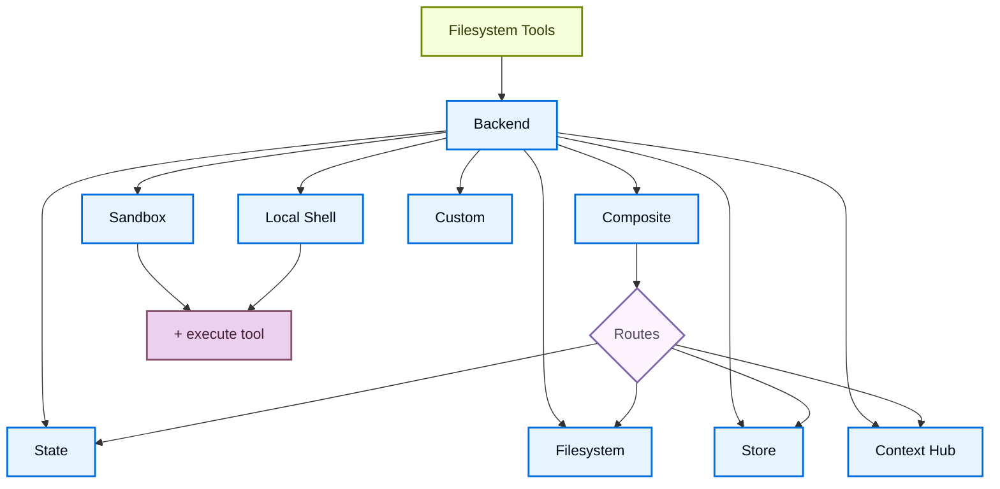

import BackendStatePy from '/snippets/code-samples/backend-state-py.mdx';
import BackendStateJs from '/snippets/code-samples/backend-state-js.mdx';
import BackendFilesystemPy from '/snippets/code-samples/backend-filesystem-py.mdx';
import BackendFilesystemJs from '/snippets/code-samples/backend-filesystem-js.mdx';
import BackendLocalShellPy from '/snippets/code-samples/backend-local-shell-py.mdx';
import BackendLocalShellJs from '/snippets/code-samples/backend-local-shell-js.mdx';
import BackendStorePy from '/snippets/code-samples/backend-store-py.mdx';
import BackendStoreJs from '/snippets/code-samples/backend-store-js.mdx';
import BackendContextHubPy from '/snippets/code-samples/backend-context-hub-py.mdx';
import BackendCompositePy from '/snippets/code-samples/backend-composite-py.mdx';
import BackendCompositeJs from '/snippets/code-samples/backend-composite-js.mdx';

Deep Agents expose a filesystem surface to the agent via tools like `ls`, `read_file`, `write_file`, `edit_file`, `glob`, and `grep`. These tools operate through a pluggable backend. The `read_file` tool natively supports image files (`.png`, `.jpg`, `.jpeg`, `.gif`, `.webp`) across all backends, returning them as multimodal content blocks.

:::js
The `read_file` tool natively supports binary files (images, PDFs, audio, video) across all backends, returning a `ReadResult` with typed `content` and `mimeType`.
:::

Sandboxes and the @[`LocalShellBackend`] also provide an `execute` tool.
This page explains how to:


- [choose a backend](#specify-a-backend),
- [route different paths to different backends](#route-to-different-backends),
- [implement your own virtual filesystem](#use-a-virtual-filesystem) (e.g., S3 or Postgres),
- [set permissions](#permissions) on filesystem access,
:::js
- [add policy hooks](#add-policy-hooks),
[work with binary and multimodal files](#multimodal-and-binary-files),
:::
- [comply with the backend protocol](#protocol-reference),
:::js
- and [update existing backends to v2](#update-existing-backends-to-v2).
:::

## Quickstart

Here are a few prebuilt filesystem backends that you can quickly use with your deep agent:

| Built-in backend | Description |
|---|---|
| [Default](#statebackend) | `agent = create_deep_agent(model="google_genai:gemini-3.1-pro-preview")` <br></br> Thread-scoped. The default filesystem backend for an agent is stored in `langgraph` state. Files persist across turns within a thread (via your checkpointer) and are not shared across threads. |
| [Local filesystem persistence](#filesystembackend-local-disk) | `agent = create_deep_agent(model="google_genai:gemini-3.1-pro-preview", backend=FilesystemBackend(root_dir="/Users/nh/Desktop/"))` <br></br>This gives the deep agent access to your local machine's filesystem. You can specify the root directory that the agent has access to. Note that any provided `root_dir` must be an absolute path. |
| [Durable store (LangGraph store)](#storebackend-langgraph-store) | `agent = create_deep_agent(model="google_genai:gemini-3.1-pro-preview", backend=StoreBackend())` <br></br>This gives the agent access to long-term storage that is _persisted across threads_. This is great for storing longer term memories or instructions that are applicable to the agent over multiple executions. |
| [Context Hub](#contexthubbackend) | `agent = create_deep_agent(model="google_genai:gemini-3.1-pro-preview", backend=ContextHubBackend("my-agent"))` <br></br>Stores files durably in a LangSmith Hub repo, without provisioning a separate LangGraph store. |
| [Sandbox](/oss/deepagents/sandboxes) | `agent = create_deep_agent(model="google_genai:gemini-3.1-pro-preview", backend=sandbox)` <br></br>Execute code in isolated environments. Sandboxes provide filesystem tools plus the `execute` tool for running shell commands. Choose from Modal, Daytona, Deno, or local VFS. |
| [Local shell](#localshellbackend-local-shell) | `agent = create_deep_agent(model="google_genai:gemini-3.1-pro-preview", backend=LocalShellBackend(root_dir=".", env={"PATH": "/usr/bin:/bin"}))` <br></br>Filesystem and shell execution directly on the host. No isolation—use only in controlled development environments. See [security considerations](#localshellbackend-local-shell) below. |
| [Composite](#compositebackend-router) | Thread-scoped by default, `/memories/` persisted across threads. The Composite backend is maximally flexible. You can specify different routes in the filesystem to point towards different backends. See Composite routing below for a ready-to-paste example. |




## Built-in backends

### StateBackend

:::python
<BackendStatePy />
:::

:::js
<BackendStateJs />
:::

**How it works:**
- Stores files in LangGraph agent state for the current thread via @[`StateBackend`].
- Persists across multiple agent turns on the same thread via checkpoints. Files are not shared across threads.

<Warning>
Designed to be used from within a graph. Calling backend methods (e.g., `state_backend.upload_files(...)`) outside of a graph run won't take effect until the graph executes.
</Warning>

**Best for:**
- A scratch pad for the agent to write intermediate results.
- Automatic eviction of large tool outputs which the agent can then read back in piece by piece.

Note that this backend is shared between the supervisor agent and subagents, and any files a subagent writes will remain in the LangGraph agent state
even after that subagent's execution is complete. Those files will continue to be available to the supervisor agent and other subagents.

### FilesystemBackend (local disk)

@[`FilesystemBackend`] reads and writes real files under a configurable root directory.

<Warning>
This backend grants agents direct filesystem read/write access.
Use with caution and only in appropriate environments.

**Appropriate use cases:**
- Local development CLIs (coding assistants, development tools)
- CI/CD pipelines (see security considerations below)

**Inappropriate use cases:**
- Web servers or HTTP APIs - use `StateBackend`, `StoreBackend`, or a [sandbox backend](/oss/deepagents/sandboxes) instead

**Security risks:**
- Agents can read any accessible file, including secrets (API keys, credentials, `.env` files)
- Combined with network tools, secrets may be exfiltrated via SSRF attacks
- File modifications are permanent and irreversible

**Recommended safeguards:**
1. Enable [Human-in-the-Loop (HITL) middleware](/oss/deepagents/human-in-the-loop) to review sensitive operations.
1. Exclude secrets from accessible filesystem paths (especially in CI/CD).
1. Use a [sandbox backend](/oss/deepagents/sandboxes) for production environments requiring filesystem interaction.
1. **Always** use `virtual_mode=True` with `root_dir` to enable path-based access restrictions (blocks `..`, `~`, and absolute paths outside root).
   Note that the default (`virtual_mode=False`) provides no security even with `root_dir` set.
</Warning>

:::python
<BackendFilesystemPy />
:::

:::js
<BackendFilesystemJs />
:::

**How it works:**
- Reads/writes real files under a configurable `root_dir`.
- You can optionally set `virtual_mode=True` to sandbox and normalize paths under `root_dir`.
- Uses secure path resolution, prevents unsafe symlink traversal when possible, can use ripgrep for fast `grep`.

**Best for:**
- Local projects on your machine
- CI sandboxes
- Mounted persistent volumes

### LocalShellBackend (local shell)

<Warning>
This backend grants agents direct filesystem read/write access **and** unrestricted shell execution on your host.
Use with extreme caution and only in appropriate environments.

**Appropriate use cases:**
- Local development CLIs (coding assistants, development tools)
- Personal development environments where you trust the agent's code
- CI/CD pipelines with proper secret management

**Inappropriate use cases:**
- Production environments (such as web servers, APIs, multi-tenant systems)
- Processing untrusted user input or executing untrusted code

**Security risks:**
- Agents can execute **arbitrary shell commands** with your user's permissions
- Agents can read any accessible file, including secrets (API keys, credentials, `.env` files)
- Secrets may be exposed
- File modifications and command execution are **permanent and irreversible**
- Commands run directly on your host system
- Commands can consume unlimited CPU, memory, disk

**Recommended safeguards:**
1. Enable [Human-in-the-Loop (HITL) middleware](/oss/deepagents/human-in-the-loop) to review and approve operations before execution. This is **strongly recommended**.
2. Run in dedicated development environments only. Never use on shared or production systems.
3. Use a [sandbox backend](/oss/deepagents/sandboxes) for production environments requiring shell execution.

**Note:** `virtual_mode=True` provides no security with shell access enabled, since commands can access any path on the system.
</Warning>

:::python
<BackendLocalShellPy />
:::

:::js
<BackendLocalShellJs />
:::

**How it works:**
- Extends `FilesystemBackend` with the `execute` tool for running shell commands on the host.
- Commands run directly on your machine using `subprocess.run(shell=True)` with no sandboxing.
- Supports `timeout` (default 120s), `max_output_bytes` (default 100,000), `env`, and `inherit_env` for environment variables.
- Shell commands use `root_dir` as the working directory but can access any path on the system.

**Best for:**
- Local coding assistants and development tools
- Quick iteration during development when you trust the agent

### StoreBackend (LangGraph store)

:::python
<BackendStorePy />
:::

:::js
<BackendStoreJs />
:::

<Note>
    When deploying to [LangSmith Deployment](/langsmith/deployment), omit the `store` parameter. The platform automatically provisions a store for your agent.
</Note>

<Tip>
    The `namespace` parameter controls data isolation. For multi-user deployments, always set a [namespace factory](/oss/deepagents/backends#namespace-factories) to isolate data per user or tenant.
</Tip>

**How it works:**
- @[`StoreBackend`] stores files in a LangGraph @[`BaseStore`] provided by the runtime, enabling cross‑thread durable storage.

**Best for:**
- When you already run with a configured LangGraph store (for example, Redis, Postgres, or cloud implementations behind @[`BaseStore`]).
- When you're deploying your agent through [LangSmith Deployment](/langsmith/deployment) (a store is automatically provisioned for your agent).

#### Namespace factories

A namespace factory controls where `StoreBackend` reads and writes data. It receives a LangGraph @[`Runtime`] and returns a tuple of strings used as the store namespace. Use namespace factories to isolate data between users, tenants, or assistants.

Pass the namespace factory to the `namespace` parameter when constructing a `StoreBackend`:

```python
NamespaceFactory = Callable[[Runtime], tuple[str, ...]]
```

The `Runtime` provides:
- `rt.context` — User-supplied context passed via LangGraph's [context schema](https://langchain-ai.github.io/langgraph/concepts/runtime/) (for example, `user_id`)
:::python
- `rt.server_info` — Server-specific metadata when running on LangGraph Server (assistant ID, graph ID, authenticated user)
- `rt.execution_info` — Execution identity information (thread ID, run ID, checkpoint ID)
:::
:::js
- `rt.serverInfo` — Server-specific metadata when running on LangGraph Server (assistant ID, graph ID, authenticated user)
- `rt.executionInfo` — Execution identity information (thread ID, run ID, checkpoint ID)
:::

:::python
<Note>
The `Runtime` argument is available in `deepagents>=0.5.2`. Earlier 0.5.x releases passed a `BackendContext` instead — see [migrating from `BackendContext`](#migrating-from-backendcontext) below. `rt.server_info` and `rt.execution_info` require `deepagents>=0.5.0`.
</Note>
:::

:::js
<Note>
The `Runtime` argument is available in `deepagents>=1.9.1`. Earlier 1.9.x releases passed a `BackendContext` instead — see [migrating from `BackendContext`](#migrating-from-backendcontext) below. `rt.serverInfo` and `rt.executionInfo` require `deepagents>=1.9.0`.
</Note>
:::

**Common namespace patterns:**

:::python
```python
from deepagents.backends import StoreBackend

# Per-user: each user gets their own isolated storage
backend = StoreBackend(
    namespace=lambda rt: (rt.server_info.user.identity,),  # [!code highlight]
)

# Per-assistant: all users of the same assistant share storage
backend = StoreBackend(
    namespace=lambda rt: (
        rt.server_info.assistant_id,  # [!code highlight]
    ),
)

# Per-thread: storage scoped to a single conversation
backend = StoreBackend(
    namespace=lambda rt: (
        rt.execution_info.thread_id,  # [!code highlight]
    ),
)
```
:::

:::js
```typescript
import { StoreBackend } from "deepagents";

// Per-user: each user gets their own isolated storage
const backend = new StoreBackend({
  namespace: (rt) => [rt.serverInfo.user.identity],  // [!code highlight]
});

// Per-assistant: all users of the same assistant share storage
const backend = new StoreBackend({
  namespace: (rt) => [rt.serverInfo.assistantId],  // [!code highlight]
});

// Per-thread: storage scoped to a single conversation
const backend = new StoreBackend({
  namespace: (rt) => [rt.executionInfo.threadId],  // [!code highlight]
});
```
:::

You can combine multiple components to create more specific scopes — for example, `(user_id, thread_id)` for per-user per-conversation isolation, or append a suffix like `"filesystem"` to disambiguate when the same scope uses multiple store namespaces.

Namespace components must contain only alphanumeric characters, hyphens, underscores, dots, `@`, `+`, colons, and tildes. Wildcards (`*`, `?`) are rejected to prevent glob injection.

:::python
<Warning>
    The `namespace` parameter will be **required** in v0.5.0. Always set it explicitly for new code.
</Warning>
:::
:::js
<Warning>
    The `namespace` parameter will be **required** in v1.9.0. Always set it explicitly for new code.
</Warning>
:::

<Note>
    When no namespace factory is provided, the legacy default uses the `assistant_id` from LangGraph config metadata. This means all users of the same [assistant](/langsmith/assistants) share the same storage. For multi-user [going to production](/oss/deepagents/going-to-production), always provide a namespace factory.
</Note>

### ContextHubBackend

:::python
<BackendContextHubPy />
:::

`ContextHubBackend` stores files in a LangSmith Hub repo. Construct it with a repo identifier in `owner/name` or `name` format.

<Note>
Set `LANGSMITH_API_KEY` before using `ContextHubBackend`.
</Note>

**How it works:**
- Pulls the Hub repo tree lazily on first use, then serves reads from an in-memory cache.
- Persists writes and edits as Hub commits and updates the cache after successful commits.
- Uses optimistic parent-commit writes (`parent_commit`): each push targets the latest known commit hash.

**Behavior and limits:**
- If the repo does not exist, first pull is treated as empty; the first successful write can create the repo.
- If another writer advances the repo first, your stale parent-commit write can fail. Re-pull and retry on conflict.
- `upload_files()` accepts UTF-8 text. Non-UTF-8 files are rejected per path with `invalid_path`.

**Best for:**
- LangSmith-native durable filesystem persistence without separately wiring a LangGraph `BaseStore`.
- Workflows that benefit from Hub commit history on filesystem changes.

### CompositeBackend (router)

:::python
<BackendCompositePy />
:::

:::js
<BackendCompositeJs />
:::

**How it works:**
- @[`CompositeBackend`] routes file operations to different backends based on path prefix.
- Preserves the original path prefixes in listings and search results.

**Best for:**
- When you want to give your agent both thread-scoped and cross-thread storage, a `CompositeBackend` allows you provide both a `StateBackend` and `StoreBackend`
- When you have multiple sources of information that you want to provide to your agent as part of a single filesystem.
    - e.g. You have long-term memories stored under `/memories/` in one Store and you also have a custom backend that has documentation accessible at /docs/.

## Specify a backend

:::python
- Pass a backend instance to `create_deep_agent(model=..., backend=...)`. The filesystem middleware uses it for all tooling.
- The backend must implement `BackendProtocol` (for example, `StateBackend()`, `FilesystemBackend(root_dir=".")`, `StoreBackend()`, `ContextHubBackend("my-agent")`).
- If omitted, the default is `StateBackend()`.
:::

:::js
- Pass a backend instance to `createDeepAgent({ backend: ... })`. The filesystem middleware uses it for all tooling.
- The backend must implement `AnyBackendProtocol` (`BackendProtocolV1` or `BackendProtocolV2`) — for example, `new StateBackend()`, `new FilesystemBackend({ rootDir: "." })`, `new StoreBackend()`.
- If omitted, the default is `new StateBackend()`.

<Note>
Before version 1.9.0, only `BackendProtocol` was supported which is now `BackendProtocolV1`. V1 backends are automatically adapted to V2 at runtime via `adaptBackendProtocol()`. No code changes are required to keep using existing V1 backends. To update to v2, see [update existing backends to v2](#update-existing-backends-to-v2).
</Note>
:::


## Route to different backends

Route parts of the namespace to different backends. Commonly used to persist `/memories/*` across threads and keep everything else thread-scoped.

:::python
```python
from deepagents import create_deep_agent
from deepagents.backends import CompositeBackend, StateBackend, FilesystemBackend

agent = create_deep_agent(
    model="google_genai:gemini-3.1-pro-preview",
    backend=CompositeBackend(
        default=StateBackend(),
        routes={
            "/memories/": FilesystemBackend(root_dir="/deepagents/myagent", virtual_mode=True),
        },
    )
)
```
:::

:::js
```typescript
import { createDeepAgent, CompositeBackend, FilesystemBackend, StateBackend } from "deepagents";

const agent = createDeepAgent({
  backend: new CompositeBackend(
    new StateBackend(),
    {
      "/memories/": new FilesystemBackend({ rootDir: "/deepagents/myagent", virtualMode: true }),
    },
  ),
});
```
:::

Behavior:
- `/workspace/plan.md` → `StateBackend` (thread-scoped)
- `/memories/agent.md` → `FilesystemBackend` under `/deepagents/myagent`
- `ls`, `glob`, `grep` aggregate results and show original path prefixes.

Notes:
- Longer prefixes win (for example, route `"/memories/projects/"` can override `"/memories/"`).
- For StoreBackend routing, ensure a store is provided via `create_deep_agent(model=..., store=...)` or provisioned by the platform.

## Use a virtual filesystem

Build a custom backend to project a remote or database filesystem (e.g., S3 or Postgres) into the tools namespace.

Design guidelines:

- Paths are absolute (`/x/y.txt`). Decide how to map them to your storage keys/rows.
- Implement `ls` and `glob` efficiently (server-side filtering where available, otherwise local filter).
- For external persistence (S3, Postgres, etc.), return `files_update=None` (Python) or omit `filesUpdate` (JS) in write/edit results — only in-memory state backends need to return a files update dict.

:::python
- Use `ls` and `glob` as the method names.
- Return structured result types with an `error` field for missing files or invalid patterns (do not raise).
:::

:::js
- Use `ls` and `glob` as the method names.
- All query methods (`ls`, `read`, `readRaw`, `grep`, `glob`) must return structured Result objects (e.g., `LsResult`, `ReadResult`) with an optional `error` field.
- Support binary files in `read()` by returning `Uint8Array` content with the appropriate `mimeType`.
:::

S3-style outline:

:::python
```python
from deepagents.backends.protocol import (
    BackendProtocol, WriteResult, EditResult, LsResult, ReadResult, GrepResult, GlobResult,
)

class S3Backend(BackendProtocol):
    def __init__(self, bucket: str, prefix: str = ""):
        self.bucket = bucket
        self.prefix = prefix.rstrip("/")

    def _key(self, path: str) -> str:
        return f"{self.prefix}{path}"

    def ls(self, path: str) -> LsResult:
        # List objects under _key(path); build FileInfo entries (path, size, modified_at)
        ...

    def read(self, file_path: str, offset: int = 0, limit: int = 2000) -> ReadResult:
        # Fetch object; return ReadResult(file_data=...) or ReadResult(error=...)
        ...

    def grep(self, pattern: str, path: str | None = None, glob: str | None = None) -> GrepResult:
        # Optionally filter server‑side; else list and scan content
        ...

    def glob(self, pattern: str, path: str = "/") -> GlobResult:
        # Apply glob relative to path across keys
        ...

    def write(self, file_path: str, content: str) -> WriteResult:
        # Enforce create‑only semantics; return WriteResult(path=file_path, files_update=None)
        ...

    def edit(self, file_path: str, old_string: str, new_string: str, replace_all: bool = False) -> EditResult:
        # Read → replace (respect uniqueness vs replace_all) → write → return occurrences
        ...
```
:::

:::js
```typescript
import {
  type BackendProtocolV2,
  type LsResult,
  type ReadResult,
  type ReadRawResult,
  type GrepResult,
  type GlobResult,
  type WriteResult,
  type EditResult,
} from "deepagents";

class S3Backend implements BackendProtocolV2 {
  constructor(private bucket: string, private prefix: string = "") {
    this.prefix = prefix.replace(/\/$/, "");
  }

  private key(path: string): string {
    return `${this.prefix}${path}`;
  }

  async ls(path: string): Promise<LsResult> {
    // List objects under key(path); return { files: [...] }
    ...
  }

  async read(filePath: string, offset?: number, limit?: number): Promise<ReadResult> {
    // Fetch object; return { content, mimeType }
    // For binary files, return Uint8Array content
    ...
  }

  async readRaw(filePath: string): Promise<ReadRawResult> {
    // Return { data: FileData }
    ...
  }

  async grep(pattern: string, path?: string | null, glob?: string | null): Promise<GrepResult> {
    // Search text files; skip binary; return { matches: [...] }
    ...
  }

  async glob(pattern: string, path = "/"): Promise<GlobResult> {
    // Apply glob relative to path; return { files: [...] }
    ...
  }

  async write(filePath: string, content: string): Promise<WriteResult> {
    // Enforce create-only semantics; return { path: filePath, filesUpdate: null }
    ...
  }

  async edit(filePath: string, oldString: string, newString: string, replaceAll?: boolean): Promise<EditResult> {
    // Read → replace → write → return { path, occurrences }
    ...
  }
}
```
:::

Postgres-style outline:

:::python
- Table `files(path text primary key, content text, created_at timestamptz, modified_at timestamptz)`
- Map tool operations onto SQL:
  - `ls` uses `WHERE path LIKE $1 || '%'`
  - `glob` filter in SQL or fetch then apply glob in Python
  - `grep` can fetch candidate rows by extension or last modified time, then scan lines
:::

:::js
- Table `files(path text primary key, content text, mime_type text, created_at timestamptz, modified_at timestamptz)`
- Map tool operations onto SQL:
  - `ls` uses `WHERE path LIKE $1 || '%'` → return `LsResult`
  - `glob` filter in SQL or fetch then apply glob locally → return `GlobResult`
  - `grep` can fetch candidate rows by extension or last modified time, then scan lines (skip rows where `mime_type` is binary) → return `GrepResult`
:::

## Permissions

Use [permissions](/oss/deepagents/permissions) to declaratively control which files and directories the agent can read or write. Permissions apply to the built-in filesystem tools and are evaluated before the backend is called.

:::python
```python
from deepagents import create_deep_agent, FilesystemPermission

agent = create_deep_agent(
    model="google_genai:gemini-3.1-pro-preview",
    backend=CompositeBackend(
        default=StateBackend(),
        routes={
            "/memories/": StoreBackend(
                namespace=lambda rt: (rt.server_info.user.identity,),
            ),
            "/policies/": StoreBackend(
                namespace=lambda rt: (rt.context.org_id,),
            ),
        },
    ),
    permissions=[
        FilesystemPermission(
            operations=["write"],
            paths=["/policies/**"],
            mode="deny",
        ),
    ],
)
```
:::

For the full set of options including rule ordering, subagent permissions, and composite backend interactions, see the [permissions guide](/oss/deepagents/permissions).

## Add policy hooks

For custom validation logic beyond path-based allow/deny rules (rate limiting, audit logging, content inspection), enforce enterprise rules by subclassing or wrapping a backend.

Block writes/edits under selected prefixes (subclass):

:::python
```python
from deepagents.backends.filesystem import FilesystemBackend
from deepagents.backends.protocol import WriteResult, EditResult

class GuardedBackend(FilesystemBackend):
    def __init__(self, *, deny_prefixes: list[str], **kwargs):
        super().__init__(**kwargs)
        self.deny_prefixes = [p if p.endswith("/") else p + "/" for p in deny_prefixes]

    def write(self, file_path: str, content: str) -> WriteResult:
        if any(file_path.startswith(p) for p in self.deny_prefixes):
            return WriteResult(error=f"Writes are not allowed under {file_path}")
        return super().write(file_path, content)

    def edit(self, file_path: str, old_string: str, new_string: str, replace_all: bool = False) -> EditResult:
        if any(file_path.startswith(p) for p in self.deny_prefixes):
            return EditResult(error=f"Edits are not allowed under {file_path}")
        return super().edit(file_path, old_string, new_string, replace_all)
```
:::

:::js
```typescript
import { FilesystemBackend, type WriteResult, type EditResult } from "deepagents";

class GuardedBackend extends FilesystemBackend {
  private denyPrefixes: string[];

  constructor({ denyPrefixes, ...options }: { denyPrefixes: string[]; rootDir?: string }) {
    super(options);
    this.denyPrefixes = denyPrefixes.map(p => p.endsWith("/") ? p : p + "/");
  }

  async write(filePath: string, content: string): Promise<WriteResult> {
    if (this.denyPrefixes.some(p => filePath.startsWith(p))) {
      return { error: `Writes are not allowed under ${filePath}` };
    }
    return super.write(filePath, content);
  }

  async edit(filePath: string, oldString: string, newString: string, replaceAll = false): Promise<EditResult> {
    if (this.denyPrefixes.some(p => filePath.startsWith(p))) {
      return { error: `Edits are not allowed under ${filePath}` };
    }
    return super.edit(filePath, oldString, newString, replaceAll);
  }
}
```
:::

Generic wrapper (works with any backend):

:::python
```python
from deepagents.backends.protocol import (
    BackendProtocol, WriteResult, EditResult, LsResult, ReadResult, GrepResult, GlobResult,
)

class PolicyWrapper(BackendProtocol):
    def __init__(self, inner: BackendProtocol, deny_prefixes: list[str] | None = None):
        self.inner = inner
        self.deny_prefixes = [p if p.endswith("/") else p + "/" for p in (deny_prefixes or [])]

    def _deny(self, path: str) -> bool:
        return any(path.startswith(p) for p in self.deny_prefixes)

    def ls(self, path: str) -> LsResult:
        return self.inner.ls(path)

    def read(self, file_path: str, offset: int = 0, limit: int = 2000) -> ReadResult:
        return self.inner.read(file_path, offset=offset, limit=limit)
    def grep(self, pattern: str, path: str | None = None, glob: str | None = None) -> GrepResult:
        return self.inner.grep(pattern, path, glob)
    def glob(self, pattern: str, path: str = "/") -> GlobResult:
        return self.inner.glob(pattern, path)
    def write(self, file_path: str, content: str) -> WriteResult:
        if self._deny(file_path):
            return WriteResult(error=f"Writes are not allowed under {file_path}")
        return self.inner.write(file_path, content)
    def edit(self, file_path: str, old_string: str, new_string: str, replace_all: bool = False) -> EditResult:
        if self._deny(file_path):
            return EditResult(error=f"Edits are not allowed under {file_path}")
        return self.inner.edit(file_path, old_string, new_string, replace_all)
```
:::

:::js
```typescript
import {
  type BackendProtocolV2,
  type LsResult,
  type ReadResult,
  type ReadRawResult,
  type GrepResult,
  type GlobResult,
  type WriteResult,
  type EditResult,
} from "deepagents";

class PolicyWrapper implements BackendProtocolV2 {
  private denyPrefixes: string[];

  constructor(private inner: BackendProtocolV2, denyPrefixes: string[] = []) {
    this.denyPrefixes = denyPrefixes.map(p => p.endsWith("/") ? p : p + "/");
  }

  private isDenied(path: string): boolean {
    return this.denyPrefixes.some(p => path.startsWith(p));
  }

  ls(path: string): Promise<LsResult> { return this.inner.ls(path); }
  read(filePath: string, offset?: number, limit?: number): Promise<ReadResult> { return this.inner.read(filePath, offset, limit); }
  readRaw(filePath: string): Promise<ReadRawResult> { return this.inner.readRaw(filePath); }
  grep(pattern: string, path?: string | null, glob?: string | null): Promise<GrepResult> { return this.inner.grep(pattern, path, glob); }
  glob(pattern: string, path?: string): Promise<GlobResult> { return this.inner.glob(pattern, path); }

  async write(filePath: string, content: string): Promise<WriteResult> {
    if (this.isDenied(filePath)) return { error: `Writes are not allowed under ${filePath}` };
    return this.inner.write(filePath, content);
  }

  async edit(filePath: string, oldString: string, newString: string, replaceAll = false): Promise<EditResult> {
    if (this.isDenied(filePath)) return { error: `Edits are not allowed under ${filePath}` };
    return this.inner.edit(filePath, oldString, newString, replaceAll);
  }
}
```
:::

:::js
## Multimodal and binary files

<Note>
Multi-modal file support (PDFs, audio, video) requires `deepagents>=1.9.0`.
</Note>

V2 backends support binary files natively. When `read()` encounters a binary file (determined by MIME type from the file extension), it returns a `ReadResult` with `Uint8Array` content and the corresponding `mimeType`. Text files return `string` content.

### Supported MIME types

| Category | Extensions | MIME types |
|----------|-----------|------------|
| Images | `.png`, `.jpg`/`.jpeg`, `.gif`, `.webp`, `.svg`, `.heic`, `.heif` | `image/png`, `image/jpeg`, `image/gif`, `image/webp`, `image/svg+xml`, `image/heic`, `image/heif` |
| Audio | `.mp3`, `.wav`, `.aiff`, `.aac`, `.ogg`, `.flac` | `audio/mpeg`, `audio/wav`, `audio/aiff`, `audio/aac`, `audio/ogg`, `audio/flac` |
| Video | `.mp4`, `.webm`, `.mpeg`/`.mpg`, `.mov`, `.avi`, `.flv`, `.wmv`, `.3gpp` | `video/mp4`, `video/webm`, `video/mpeg`, `video/quicktime`, `video/x-msvideo`, `video/x-flv`, `video/x-ms-wmv`, `video/3gpp` |
| Documents | `.pdf`, `.ppt`, `.pptx` | `application/pdf`, `application/vnd.ms-powerpoint`, `application/vnd.openxmlformats-officedocument.presentationml.presentation` |
| Text | `.txt`, `.html`, `.json`, `.js`, `.ts`, `.py`, etc. | `text/plain`, `text/html`, `application/json`, etc. |

### Read binary files

```typescript
const result = await backend.read("/workspace/screenshot.png");

if (result.error) {
  console.error(result.error);
} else if (result.content instanceof Uint8Array) {
  // Binary file — content is Uint8Array, mimeType is set
  console.log(`Binary file: ${result.mimeType}`); // "image/png"
} else {
  // Text file — content is string
  console.log(`Text file: ${result.mimeType}`); // "text/plain"
}
```

### FileData format

`FileData` is the type used to store file content in state and store backends.

```typescript
type FileData =
  // Current format (v2)
  | {
      content: string | Uint8Array; // string for text, Uint8Array for binary
      mimeType: string;             // e.g. "text/plain", "image/png"
      created_at: string;           // ISO 8601 timestamp
      modified_at: string;          // ISO 8601 timestamp
    }
  // Legacy format (v1)
  | {
      content: string[];            // array of lines
      created_at: string;           // ISO 8601 timestamp
      modified_at: string;          // ISO 8601 timestamp
    };
```

Backends may encounter either format when reading from state or store. The framework handles both transparently. New writes default to the v2 format. During rolling deployments where older readers need the legacy format, pass `fileFormat: "v1"` to the backend constructor (e.g., `new StoreBackend({ fileFormat: "v1" })`).
:::

## Migrate from backend factories

<Warning>
:::python
The backend factory pattern is **deprecated** as of `deepagents` 0.5.0. Pass pre-constructed backend instances directly instead of factory functions.
:::
:::js
The backend factory pattern is **deprecated** as of `deepagents` 1.9.0. Pass pre-constructed backend instances directly instead of factory functions.
:::
</Warning>

Previously, backends like `StateBackend` and `StoreBackend` required a factory function that received a runtime object, because they needed runtime context (state, store) to operate. Backends now resolve this context internally via LangGraph's `get_config()`, `get_store()`, and `get_runtime()` helpers, so you can pass instances directly.

### What changed

| Before (deprecated) | After |
|---|---|
| `backend=lambda rt: StateBackend(rt)` | `backend=StateBackend()` |
| `backend=lambda rt: StoreBackend(rt)` | `backend=StoreBackend()` |
| `backend=lambda rt: CompositeBackend(default=StateBackend(rt), ...)` | `backend=CompositeBackend(default=StateBackend(), ...)` |
| `backend: (config) => new StateBackend(config)` | `backend: new StateBackend()` |
| `backend: (config) => new StoreBackend(config)` | `backend: new StoreBackend()` |

### Deprecated APIs

:::python

| Deprecated | Replacement |
|---|---|
| Passing a callable to `backend=` in `create_deep_agent` | Pass a backend instance directly |
| `runtime` constructor argument on `StateBackend(runtime)` | `StateBackend()` (no arguments needed) |
| `runtime` constructor argument on `StoreBackend(runtime)` | `StoreBackend()` or `StoreBackend(namespace=..., store=...)` |
| `files_update` field on `WriteResult` and `EditResult` | State writes are now handled internally by the backend |
| `Command` wrapping in middleware write/edit tools | Tools return plain strings; no `Command(update=...)` needed |

:::

:::js

| Deprecated | Replacement |
|---|---|
| `BackendFactory` type | Pass a backend instance directly |
| `BackendRuntime` interface | Backends resolve context internally |
| `StateBackend(runtime, options?)` constructor overload | `new StateBackend(options?)` |
| `StoreBackend(stateAndStore, options?)` constructor overload | `new StoreBackend(options?)` |
| `filesUpdate` field on `WriteResult` and `EditResult` | State writes are now handled internally by the backend |

:::

<Note>
The factory pattern still works at runtime and emits a deprecation warning. Update your code to use direct instances before the next major version.
</Note>

### Migration example

:::python
```python
# Before (deprecated)
from deepagents import create_deep_agent
from deepagents.backends import CompositeBackend, StateBackend, StoreBackend

agent = create_deep_agent(
    model="google_genai:gemini-3.1-pro-preview",
    backend=lambda rt: CompositeBackend(
        default=StateBackend(rt),
        routes={"/memories/": StoreBackend(rt, namespace=lambda rt: (rt.server_info.user.identity,))},
    ),
)

# After
agent = create_deep_agent(
    model="google_genai:gemini-3.1-pro-preview",
    backend=CompositeBackend(
        default=StateBackend(),
        routes={"/memories/": StoreBackend(namespace=lambda rt: (rt.server_info.user.identity,))},
    ),
)
```
:::

:::js
```typescript
// Before (deprecated)
import { createDeepAgent, CompositeBackend, StateBackend, StoreBackend } from "deepagents";

const agent = createDeepAgent({
  backend: (config) => new CompositeBackend(
    new StateBackend(config),
    { "/memories/": new StoreBackend(config, {
      namespace: (rt) => [rt.serverInfo.user.identity],
    }) },
  ),
});

// After
const agent = createDeepAgent({
  backend: new CompositeBackend(
    new StateBackend(),
    { "/memories/": new StoreBackend({
      namespace: (rt) => [rt.serverInfo.user.identity],
    }) },
  ),
});
```
:::

### Migrating from `BackendContext`

In `deepagents>=0.5.2` (Python) and `deepagents>=1.9.1` (TypeScript), namespace factories receive a LangGraph @[`Runtime`] directly instead of a `BackendContext` wrapper. The old `BackendContext` form still works via backwards-compatible `.runtime` and `.state` accessors, but those accessors emit a deprecation warning and will be removed in `deepagents>=0.7`.

**What changed:**

- The factory argument is now a `Runtime`, not a `BackendContext`.
- Drop the `.runtime` accessor — for example, `ctx.runtime.context.user_id` becomes `rt.server_info.user.identity`.
- There is no direct replacement for `ctx.state`. Namespace info should be read-only and stable for the lifetime of a run, whereas state is mutable and changes step-to-step—deriving a namespace from it risks data ending up under inconsistent keys. If you have a use case that requires reading agent state, please [open an issue](https://github.com/langchain-ai/deepagents/issues).

:::python
```python
# Before (deprecated, removed in v0.7)
StoreBackend(
    namespace=lambda ctx: (ctx.runtime.context.user_id,),  # [!code --]
)

# After
StoreBackend(
    namespace=lambda rt: (rt.server_info.user.identity,),  # [!code ++]
)
```
:::

:::js
```typescript
// Before (deprecated, removed in v0.7)
new StoreBackend({
  namespace: (ctx) => [ctx.runtime.context.userId],  // [!code --]
});

// After
new StoreBackend({
  namespace: (rt) => [rt.serverInfo.user.identity],  // [!code ++]
});
```
:::

## Protocol reference

Backends must implement @[`BackendProtocol`].

Required methods:
- `ls(path: str) -> LsResult`
  - Return entries with at least `path`. Include `is_dir`, `size`, `modified_at` when available. Sort by `path` for deterministic output.
- `read(file_path: str, offset: int = 0, limit: int = 2000) -> ReadResult`
  - Return file data on success. On missing file, return `ReadResult(error="Error: File '/x' not found")`.
- `grep(pattern: str, path: Optional[str] = None, glob: Optional[str] = None) -> GrepResult`
  - Return structured matches. On error, return `GrepResult(error="...")` (do not raise).
- `glob(pattern: str, path: str = "/") -> GlobResult`
  - Return matched files as `FileInfo` entries (empty list if none).
- `write(file_path: str, content: str) -> WriteResult`
  - Create-only. On conflict, return `WriteResult(error=...)`. On success, set `path` and for state backends set `files_update={...}`; external backends should use `files_update=None`.
- `edit(file_path: str, old_string: str, new_string: str, replace_all: bool = False) -> EditResult`
  - Enforce uniqueness of `old_string` unless `replace_all=True`. If not found, return error. Include `occurrences` on success.

Supporting types:
- `LsResult(error, entries)` — `entries` is a `list[FileInfo]` on success, `None` on failure.
- `ReadResult(error, file_data)` — `file_data` is a `FileData` dict on success, `None` on failure.
- `GrepResult(error, matches)` — `matches` is a `list[GrepMatch]` on success, `None` on failure.
- `GlobResult(error, matches)` — `matches` is a `list[FileInfo]` on success, `None` on failure.
- `WriteResult(error, path, files_update)`
- `EditResult(error, path, files_update, occurrences)`
- `FileInfo` with fields: `path` (required), optionally `is_dir`, `size`, `modified_at`.
- `GrepMatch` with fields: `path`, `line`, `text`.
- `FileData` with fields: `content` (str), `encoding` (`"utf-8"` or `"base64"`), `created_at`, `modified_at`.
:::

:::js
Backends implement `BackendProtocolV2`. All query methods return structured Result objects with `{ error?: string, ...data }`.

### Required methods

- **`ls(path: string) → LsResult`**
  - List files and directories in the specified directory (non-recursive). Directories have a trailing `/` in their path and `is_dir=true`. Include `is_dir`, `size`, `modified_at` when available.

- **`read(filePath: string, offset?: number, limit?: number) → ReadResult`**
  - Read file content. For text files, content is paginated by line offset/limit (default offset 0, limit 500). For binary files, the full raw `Uint8Array` content is returned with the `mimeType` field set. On missing file, return `{ error: "File '/x' not found" }`.

- **`readRaw(filePath: string) → ReadRawResult`**
  - Read file content as raw `FileData`. Returns the full file data including timestamps.

- **`grep(pattern: string, path?: string | null, glob?: string | null) → GrepResult`**
  - Search file contents for a literal text pattern. Binary files (determined by MIME type) are skipped. On failure, return `{ error: "..." }`.

- **`glob(pattern: string, path?: string) → GlobResult`**
  - Return files matching a glob pattern as `FileInfo` entries.

- **`write(filePath: string, content: string) → WriteResult`**
  - Create-only semantics. On conflict, return `{ error: "..." }`. On success, set `path` and for state backends set `filesUpdate={...}`; external backends should use `filesUpdate=null`.

- **`edit(filePath: string, oldString: string, newString: string, replaceAll?: boolean) → EditResult`**
  - Enforce uniqueness of `oldString` unless `replaceAll=true`. If not found, return error. Include `occurrences` on success.

### Optional methods

- **`uploadFiles(files: Array<[string, Uint8Array]>) → FileUploadResponse[]`** — Upload multiple files (for sandbox backends).
- **`downloadFiles(paths: string[]) → FileDownloadResponse[]`** — Download multiple files (for sandbox backends).

### Result types

| Type | Success fields | Error field |
|------|----------------|-------------|
| `ReadResult` | `content?: string \| Uint8Array`, `mimeType?: string` | `error` |
| `ReadRawResult` | `data?: FileData` | `error` |
| `LsResult` | `files?: FileInfo[]` | `error` |
| `GlobResult` | `files?: FileInfo[]` | `error` |
| `GrepResult` | `matches?: GrepMatch[]` | `error` |
| `WriteResult` | `path?: string` | `error` |
| `EditResult` | `path?: string`, `occurrences?: number` | `error` |

### Supporting types

- **`FileInfo`** — `path` (required), optionally `is_dir`, `size`, `modified_at`.
- **`GrepMatch`** — `path`, `line` (1-indexed), `text`.
- **`FileData`** — File content with timestamps. See [FileData format](#filedata-format).

### Sandbox extension

`SandboxBackendProtocolV2` extends `BackendProtocolV2` with:

- **`execute(command: string) → ExecuteResponse`** — Run a shell command in the sandbox.
- **`readonly id: string`** — Unique identifier for the sandbox instance.
:::

:::js
## Update existing backends to V2

<Accordion title="Migration guide">

### Method renames

| V1 method | V2 method | Return type change |
|-----------|-----------|-------------------|
| `lsInfo(path)` | `ls(path)` | `FileInfo[]` → `LsResult` |
| `read(filePath, offset, limit)` | `read(filePath, offset, limit)` | `string` → `ReadResult` |
| `readRaw(filePath)` | `readRaw(filePath)` | `FileData` → `ReadRawResult` |
| `grepRaw(pattern, path, glob)` | `grep(pattern, path, glob)` | `GrepMatch[] \| string` → `GrepResult` |
| `globInfo(pattern, path)` | `glob(pattern, path)` | `FileInfo[]` → `GlobResult` |
| `write(...)` | `write(...)` | Unchanged (`WriteResult`) |
| `edit(...)` | `edit(...)` | Unchanged (`EditResult`) |

### Type renames

| V1 type | V2 type |
|---------|---------|
| `BackendProtocol` | `BackendProtocolV2` |
| `SandboxBackendProtocol` | `SandboxBackendProtocolV2` |

### Adaptation utilities

If you have existing V1 backends that you need to use with V2-only code, use the adaptation functions:

```typescript
import { adaptBackendProtocol, adaptSandboxProtocol } from "deepagents";

// Adapt a V1 backend to V2
const v2Backend = adaptBackendProtocol(v1Backend);

// Adapt a V1 sandbox to V2
const v2Sandbox = adaptSandboxProtocol(v1Sandbox);
```

<Note>
The framework auto-adapts V1 backends passed to `createDeepAgent()`. Manual adaptation is only needed when calling protocol methods directly.
</Note>

</Accordion>
:::
