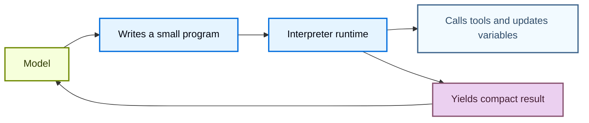
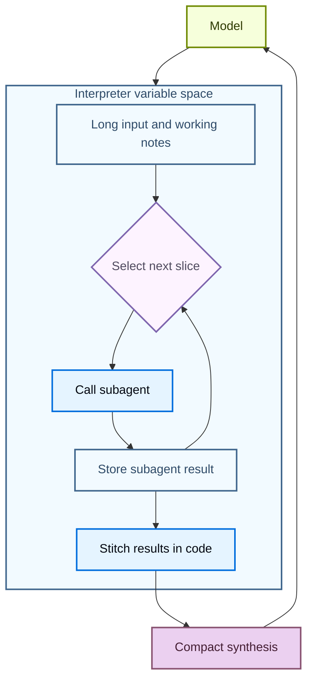

Interpreters give agents a programmable workspace where they can explore data, coordinate tool calls, and keep intermediate work out of the model context. The agent writes code to express its intent, then an **in-memory** runtime executes that code and returns the relevant results.

Where [sandboxes](/oss/deepagents/sandboxes) are a code-first way for acting on an environment (such as running commands, installing dependencies, and editing files), interpreters are a code-first way for acting inside the agent loop: composing tools, preserving state, and deciding what information should return to the model.

<Warning>
    Interpreters are experimental. APIs and lifecycle behavior may change between releases.
</Warning>

:::python
<Note>
    Interpreters require `langchain-quickjs>=0.1.0` and Python `>=3.11`.
</Note>
:::

## When to use an interpreter

Most agent work alternates between model reasoning and tool execution. That works for simple actions, but it becomes awkward when the agent needs to compose many steps, reason over structured data, or manage intermediate state.

An interpreter gives the agent a runtime for that work. Instead of asking the model to choose every next step one tool call at a time, the agent can write a small program that runs control flow, calls allowlisted tools, stores variables, and returns a compact result to the model.

Use interpreters when the agent needs to:

- Compose multiple tool calls with code, including loops, branching, retries, and concurrency.
- Coordinate subagents from code by splitting work into focused calls, storing their results, and stitching those results into a final synthesis.
- Keep intermediate values in runtime state instead of sending every temporary result back through the model context.
- Transform structured data deterministically, such as sorting, grouping, parsing, validating, scoring, or aggregating.
- Explore a large variable space and return only selected evidence, summaries, or outputs to the model.



This works by running code against [**QuickJS**](https://github.com/quickjs-ng/quickjs), a lightweight JavaScript runtime designed for embedded execution. The runtime gives the agent a place to evaluate code without exposing host filesystem, network, shell, package, or clock APIs by default.

QuickJS is the execution boundary for interpreter code. Explicit bridges, such as programmatic tool calling, decide what capabilities the code can access.

## Choose the right execution path

| Need | Use |
| --- | --- |
| One or two simple external calls | Normal tool calling |
| A small program that loops, branches, retries, or aggregates results | Interpreter |
| Many selected tool calls that should run from code | Interpreter with programmatic tool calling |
| Reusable helpers used across threads | Interpreter with [interpreter skills](/oss/deepagents/skills#use-interpreter-skills) |
| Shell commands, package installs, tests, or full OS filesystem access | [Sandboxes](/oss/deepagents/sandboxes) |

## Add an interpreter to an agent

Install the QuickJS middleware package, then add the middleware when creating the agent.

:::python
<CodeGroup>
```bash pip
pip install -U "deepagents[quickjs]"
```

```bash uv
uv add "deepagents[quickjs]"
```
</CodeGroup>

```python
from deepagents import create_deep_agent
from langchain_quickjs import CodeInterpreterMiddleware

agent = create_deep_agent(
    model="openai:gpt-5.4",
    middleware=[CodeInterpreterMiddleware()],
)
```
:::

:::js
<CodeGroup>
```bash npm
npm install deepagents @langchain/quickjs
```

```bash pnpm
pnpm add deepagents @langchain/quickjs
```

```bash yarn
yarn add deepagents @langchain/quickjs
```
</CodeGroup>

```typescript
import { createDeepAgent } from "deepagents";
import { createCodeInterpreterMiddleware } from "@langchain/quickjs";

const agent = createDeepAgent({
  model: "openai:gpt-5.4",
  middleware: [createCodeInterpreterMiddleware()],
});
```
:::

## Run code in the interpreter

The middleware adds an `eval` tool to the agent. The tool runs TypeScript in a persistent context, captures `console.log`, and returns the result of the last expression.

The agent can write code like this:

```javascript
const rows = [
  { team: "alpha", score: 8 },
  { team: "beta", score: 13 },
  { team: "alpha", score: 21 },
];

const totals = rows.reduce((acc, row) => {
  acc[row.team] = (acc[row.team] ?? 0) + row.score;
  console.log(`${row.team} score: ${acc[row.team]}`)
  return acc;
}, {});

totals;
```

:::python
By default, interpreter state also persists across turns in the same thread by snapshotting the working state after each agent run, and restoring it before the next run.
:::

## Programmatic tool calling

Programmatic tool calling (PTC) exposes selected agent tools inside the interpreter under the global `tools` namespace. Instead of asking the model to issue one tool call, wait for the result, and then decide the next call, the agent can write code that calls tools in loops, branches, retries, or parallel batches.

This is useful when intermediate tool results are only inputs to the next step. The interpreter can process, filter, or aggregate those results before anything returns to the model context, which can make multi-tool/multi-step workflows more token efficient.

PTC is model-agnostic in Deep Agents. It is implemented by middleware rather than a provider-specific code-execution or tool-calling API.

### How it works

1. You choose which tools the interpreter can call with the `ptc` allowlist.
2. The middleware exposes those tools as async JavaScript functions under `tools`.
3. The agent writes interpreter code that calls those functions with `await`.
4. The interpreter runs the tool bridge, receives the tool result, and continues executing code.
5. The model receives the final interpreter output, not every intermediate value.

Each allowlisted tool becomes an async function. Tool names are converted to camel case, but the input object still follows the tool's schema. For example, a tool named `web_search` becomes `tools.webSearch(...)`:

```typescript
const result: string = await tools.webSearch({
  query: "deepagents interpreters",
});
```

### Useful patterns

| **Pattern** | **What the interpreter can do** |
| --- | --- |
| Batch processing | Loop over many inputs and call a tool for each one. |
| Parallel work | Use `Promise.all` for independent calls. |
| Conditional logic | Choose the next tool call based on earlier results. |
| Early termination | Stop calling tools once a success condition is met. |
| Data filtering | Return only relevant rows, snippets, errors, or summaries to the model. |
| Recursive orchestration | Call `task` repeatedly, then combine subagent results in code. |

### Enable PTC

Enable PTC with an explicit allowlist:

:::python
```python
from deepagents import create_deep_agent
from langchain_quickjs import CodeInterpreterMiddleware

agent = create_deep_agent(
    model="openai:gpt-5.4",
    middleware=[CodeInterpreterMiddleware(ptc=["task"])],
)
```
:::

:::js
```typescript
import { createDeepAgent } from "deepagents";
import { createCodeInterpreterMiddleware } from "@langchain/quickjs";

const agent = createDeepAgent({
  model: "openai:gpt-5.4",
  middleware: [createCodeInterpreterMiddleware({ ptc: ["task"] })],
});
```
:::

After PTC is enabled, the agent can call the allowlisted tool from interpreter code. This example launches several subagents in parallel and combines their final reports before returning to the model:

```javascript
const topics = ["retrieval", "memory", "evaluation"];

const reports = await Promise.all(
  topics.map((topic) =>
    tools.task({
      description: `Research ${topic} in Deep Agents and return three concise findings.`,
      subagent_type: "general-purpose",
    }),
  ),
);

reports.join("\n\n");
```

Because this is code, the agent can also handle failures locally:

```javascript
try {
  const report = await tools.task({
    description: "Check the migration notes and return breaking changes.",
    subagent_type: "general-purpose",
  });
  console.log(report);
} catch (error) {
  console.log(`Subagent failed: ${error.message}`);
}
```

<Warning>
    PTC calls currently execute through the interpreter bridge and do not go through the normal tool calling path. As a result, `interrupt_on` approval workflows are not enforced per PTC-invoked tool call.
</Warning>

## Recursive language models

Recursive language models use an interpreter as a workspace for decomposition. The model keeps a large input or working set in runtime variables, writes code to inspect and split it, calls subagents or other model tools on smaller pieces, and then stitches the returned results together in code.

This separates the variable space from the agent's context. The variable space is information stored in the interpreter, and the agent's context is what the model actually processes in the next model call. The model can decide which snippets become subagent tasks, which results need another pass, and what final synthesis should return to the main conversation.



For background on this pattern, see the [Recursive Language Models paper](https://arxiv.org/abs/2512.24601).

In Deep Agents, the recursive call is often the `task` tool exposed through programmatic tool calling. The interpreter can call subagents over many slices, combine their answers, and return a single synthesized result:

```javascript
const candidates = notes
  .filter((note) => note.includes("migration"))
  .slice(0, 5);

const riskReports = await Promise.all(
  candidates.map((note) =>
    tools.task({
      description: `Analyze this migration note for release risk. Return risks, affected users, and recommended follow-up:\n\n${note}`,
      subagent_type: "general-purpose",
    }),
  ),
);

const releaseSummary = riskReports
  .map((report, index) => `## Candidate ${index + 1}\n${report}`)
  .join("\n\n");

releaseSummary;
```

## Interpreter skills

Interpreter skills are [skills](/oss/deepagents/skills) that expose code modules to an interpreter. When configured with interpreter middleware, the agent can import these modules from code and use them for deterministic helper logic.

Interpreter skills are useful when the agent needs reusable helpers for structured data workflows, such as sorting, grouping, scoring, parsing, validating, or aggregating data. For setup details, see [Interpreter skills](/oss/deepagents/skills#use-interpreter-skills).

:::python
## Snapshots and time travel

`CodeInterpreterMiddleware` snapshots interpreter state after each agent run and restores it before the next run by default. A snapshot is a serialized copy of the interpreter's in-memory JavaScript state, including globals, variables, functions, and imported modules that exist when the agent finishes running code.

Across conversation turns, the lifecycle is:

1. A turn starts, and `CodeInterpreterMiddleware` restores the latest interpreter snapshot for the thread.
2. The agent calls `eval`, and the code can read or mutate interpreter variables.
3. The agent run finishes, and the middleware snapshots the updated interpreter state into graph state.
4. The next turn starts from that restored interpreter state instead of an empty runtime.

Within a single agent run, repeated `eval` calls use the live interpreter context object. The middleware does not snapshot and restore between those calls; it snapshots the context when the run completes so it can be restored on a later turn or checkpoint replay.

<Note>
    Between conversation turns, snapshots only retain values that can be reasonably serialized. Use them for data, not for live runtime objects. Functions, classes, and other unserializable values are restored as unaccessible artifacts. If interpreter code accesses one after restore, the eval tool will throw an error like `Value for 'fn' was not restored because it is not serializable (type: function).`
</Note>

Snapshots preserve interpreter memory, not outside-world effects. If interpreter code calls a tool through PTC, restoring a prior interpreter snapshot does not undo side effects from that tool call. It only restores the interpreter variables that recorded or processed the result.

When the graph uses a checkpointer, this pairs with [LangGraph time travel](/oss/langgraph/use-time-travel). Restoring a graph checkpoint can restore the interpreter snapshot stored in graph state, so you can return to an earlier agent context and interpreter state while debugging or replaying.

```python
from deepagents import create_deep_agent
from langchain_quickjs import CodeInterpreterMiddleware
from langgraph.checkpoint.memory import MemorySaver

checkpointer = MemorySaver()

agent = create_deep_agent(
    model="openai:gpt-5.4",
    checkpointer=checkpointer,
    middleware=[
        CodeInterpreterMiddleware(
            snapshot_between_turns=True,  # Default
        )
    ],
)
```

You can disable cross-turn snapshots with `snapshot_between_turns=False`.
:::

## Security and limits

Interpreters use QuickJS to run untrusted JavaScript with strict default isolation. Treat that as a scoped interpreter runtime, not a full production sandbox backend.

Every tool you expose through PTC is an outside capability that interpreter code can use. Treat the PTC allowlist as a permission boundary: expose only the tools the agent needs, and avoid bridging broad tools that can access sensitive systems, spend money, mutate data, or call unrestricted networks unless that behavior is intentional.

:::python
| Capability | Available by default | How to expose it |
| --- | --- | --- |
| JavaScript execution | Yes | Add interpreter middleware |
| Top-level `await` | Yes | Use promises in interpreter code |
| `console.log` capture | Yes | Disable with `capture_console=False` |
| Agent tools | No | Add a PTC allowlist |
| Interpreter skill modules | No | Add a `module` entry and configure `skills_backend` or `skillsBackend` |
| Filesystem access | No | Add the [built-in filesystem tools](/oss/deepagents/harness#virtual-filesystem-access) via the PTC allowlist |
| Network access | No | Expose a specific network tool through PTC |
| Wall-clock or datetime access | No | Expose an explicit time tool if needed |
| Shell commands, package installs, tests, OS-level execution | No | Use a [sandbox backend](/oss/deepagents/sandboxes) |
:::
:::js
| Capability | Available by default | How to expose it |
| --- | --- | --- |
| JavaScript execution | Yes | Add interpreter middleware |
| Top-level `await` | Yes | Use promises in interpreter code |
| `console.log` capture | Yes | Disable with `captureConsole: false` |
| Agent tools | No | Add a PTC allowlist |
| Interpreter skill modules | No | Add a `module` entry and configure `skills_backend` or `skillsBackend` |
| Filesystem access | No | Add the [built-in filesystem tools](/oss/deepagents/harness#virtual-filesystem-access) via the PTC allowlist |
| Network access | No | Expose a specific network tool through PTC |
| Wall-clock or datetime access | No | Expose an explicit time tool if needed |
| Shell commands, package installs, tests, OS-level execution | No | Use a [sandbox backend](/oss/deepagents/sandboxes) |
:::

:::python
<Note>
    **How code execution works**

    Interpreter code runs in an embedded QuickJS context, not a separate VM or process. In Python, this runtime is provided by [`quickjs-rs`](https://github.com/langchain-ai/quickjs-rs), which documents the same-process execution boundary in its [Security guide](https://github.com/langchain-ai/quickjs-rs#security).

    Treat interpreters as a capability-scoped execution layer, not a host-memory isolation boundary. For untrusted or semi-trusted code, run agents in isolated worker processes or containers and keep the PTC allowlist narrow.
</Note>
:::

## Middleware options

:::python
`CodeInterpreterMiddleware` accepts the following options:

| Kwarg | Default | Purpose |
| --- | --- | --- |
| `memory_limit` | `64 * 1024 * 1024` <br/>(64 MB) | QuickJS heap memory limit in bytes. |
| `timeout` | `5.0` | Per-eval timeout in seconds. |
| `max_ptc_calls` | `256` | Maximum `tools.*` calls per eval. Use `None` only in trusted environments. |
| `tool_name` | `"eval"` | Name of the interpreter tool exposed to the model. |
| `max_result_chars` | `4000` | Maximum characters returned from result and stdout blocks. |
| `capture_console` | `True` | Whether `console.log`, `console.warn`, and `console.error` output is captured. |
| `ptc` | `None` | PTC allowlist: list of tool names or `BaseTool` instances. |
| `skills_backend` | `None` | Backend used to resolve interpreter skill modules. |
| `snapshot_between_turns` | `True` | Whether interpreter state snapshots persist across agent turns. |
| `max_snapshot_bytes` | `None` | Maximum serialized snapshot size. Defaults to `memory_limit`. |
:::

:::js
`createCodeInterpreterMiddleware` accepts the following options:

| Option | Default | Purpose |
| --- | --- | --- |
| `ptc` | omitted | PTC allowlist: array of tool names or `StructuredToolInterface` instances. |
| `memoryLimitBytes` | `64 * 1024 * 1024` <br/>(64 MB) | QuickJS memory limit in bytes. |
| `maxStackSizeBytes` | `320 * 1024` | QuickJS stack size limit in bytes. |
| `executionTimeoutMs` | `5000` | Per-eval timeout in milliseconds. Negative values disable the timeout. |
| `systemPrompt` | `null` | Override the built-in interpreter system prompt. |
| `skillsBackend` | omitted | Backend used to resolve interpreter skill modules. |
| `maxPtcCalls` | `256` | Maximum `tools.*` calls per eval. Use `null` only in trusted environments. |
| `maxResultChars` | `4000` | Maximum characters retained from console output, result, and error strings. |
| `toolName` | `"eval"` | Name of the interpreter tool exposed to the model. |
| `captureConsole` | `true` | Whether `console.log`, `console.warn`, and `console.error` output is captured. |
:::
