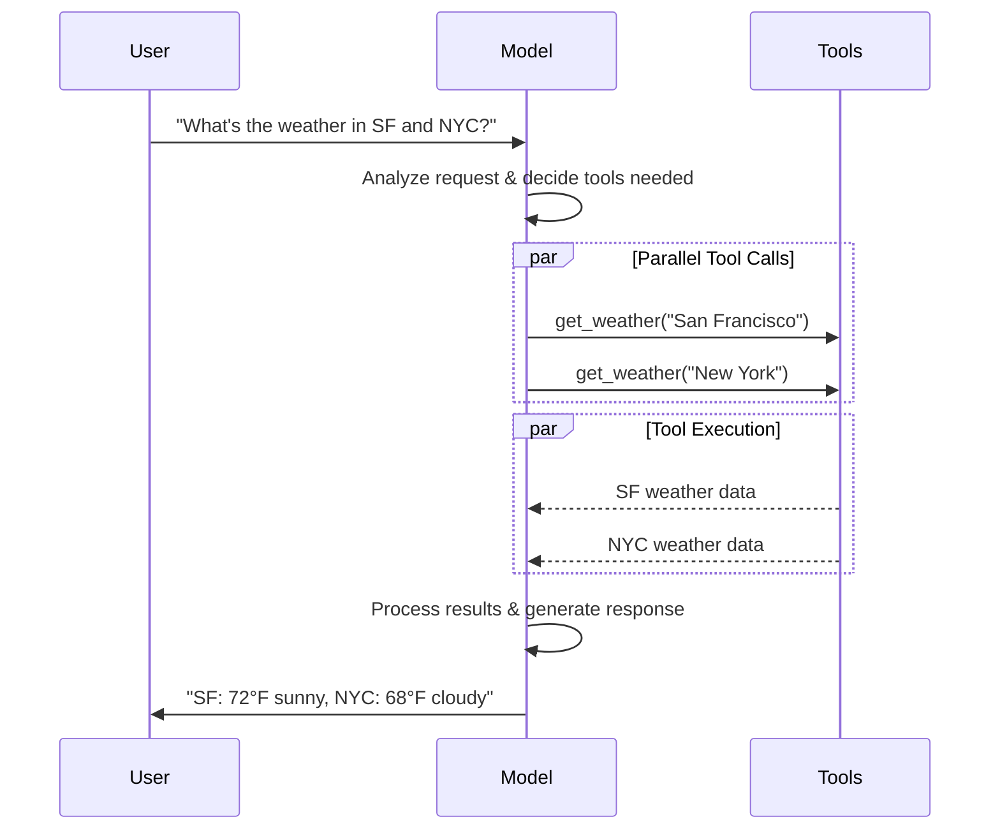
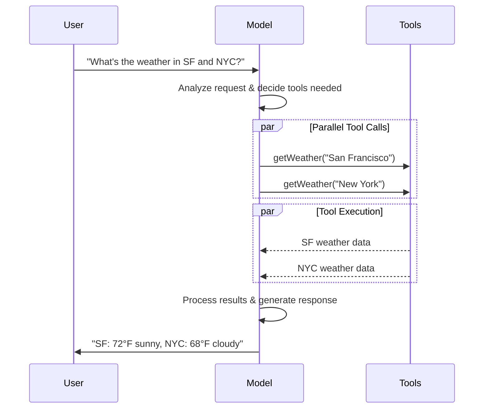

import ChatModelTabsPy from '/snippets/chat-model-tabs.mdx';
import ChatModelTabsJS from '/snippets/chat-model-tabs-js.mdx';

[LLMs](https://en.wikipedia.org/wiki/Large_language_model) are powerful AI tools that can interpret and generate text like humans. They're versatile enough to write content, translate languages, summarize, and answer questions without needing specialized training for each task.

In addition to text generation, many models support:

* <Icon icon="hammer" size={16} /> [Tool calling](#tool-calling) - calling external tools (like databases queries or API calls) and use results in their responses.
* <Icon icon="layout-grid" size={16} /> [Structured output](#structured-output) - where the model's response is constrained to follow a defined format.
* <Icon icon="photo" size={16} /> [Multimodality](#multimodal) - process and return data other than text, such as images, audio, and video.
* <Icon icon="brain" size={16} /> [Reasoning](#reasoning) - models perform multi-step reasoning to arrive at a conclusion.

Models are the reasoning engine of [agents](/oss/langchain/agents). They drive the agent's decision-making process, determining which tools to call, how to interpret results, and when to provide a final answer.

The quality and capabilities of the model you choose directly impact your agent's baseline reliability and performance. Different models excel at different tasks - some are better at following complex instructions, others at structured reasoning, and some support larger context windows for handling more information.

LangChain's standard model interfaces give you access to many different provider integrations, which makes it easy to experiment with and switch between models to find the best fit for your use case.

<Info>
    For provider-specific integration information and capabilities, see the provider's [chat model page](/oss/integrations/chat).
</Info>

## Basic usage

Models can be utilized in two ways:

1. **With agents** - Models can be dynamically specified when creating an [agent](/oss/langchain/agents#model).
2. **Standalone** - Models can be called directly (outside of the agent loop) for tasks like text generation, classification, or extraction without the need for an agent framework.

The same model interface works in both contexts, which gives you the flexibility to start simple and scale up to more complex agent-based workflows as needed.

### Initialize a model

:::python
The easiest way to get started with a standalone model in LangChain is to use @[`init_chat_model`] to initialize one from a chat model provider of your choice (examples below):

<ChatModelTabsPy />
```python
response = model.invoke("Why do parrots talk?")
```

See @[`init_chat_model`][init_chat_model] for more detail, including information on how to pass model [parameters](#parameters).
:::
:::js
The easiest way to get started with a standalone model in LangChain is to use `initChatModel` to initialize one from a [chat model provider](/oss/integrations/chat) of your choice (examples below):

<ChatModelTabsJS />
```typescript
const response = await model.invoke("Why do parrots talk?");
```
See @[`initChatModel`][initChatModel] for more detail, including information on how to pass model [parameters](#parameters).
:::

### Supported providers and models

LangChain supports all major model providers through dedicated integration packages. Each provider package implements the same standard interface, so you can swap providers without rewriting application logic. New model names work immediately — no LangChain update required — because provider packages pass model names directly to the provider's API.

Browse the [full list of supported providers](/oss/integrations/providers/overview), or see [Providers and models](/oss/concepts/providers-and-models) for a conceptual overview of how providers, packages, and model names work together in LangChain.

### Key methods

<Card title="Invoke" href="#invoke" icon="send" arrow="true" horizontal>
    The model takes messages as input and outputs messages after generating a complete response.
</Card>
<Card title="Stream" href="#stream" icon="broadcast" arrow="true" horizontal>
    Invoke the model, but stream the output as it is generated in real-time.
</Card>
<Card title="Batch" href="#batch" icon="grip-vertical" arrow="true" horizontal>
    Send multiple requests to a model in a batch for more efficient processing.
</Card>

<Info>
    In addition to chat models, LangChain provides support for other adjacent technologies, such as embedding models and vector stores. See the [integrations page](/oss/integrations/providers/overview) for details.
</Info>

## Parameters

A chat model takes parameters that can be used to configure its behavior. The full set of supported parameters varies by model and provider, but standard ones include:

<ParamField body="model" type="string" required>
   The name or identifier of the specific model you want to use with a provider. You can also specify both the model and its provider in a single argument using the '{model_provider}:{model}' format, for example, 'openai:o1'.
</ParamField>

:::python
<ParamField body="api_key" type="string">
    The key required for authenticating with the model's provider. This is usually issued when you sign up for access to the model. Often accessed by setting an <Tooltip tip="A variable whose value is set outside the program, typically through functionality built into the operating system or microservice.">environment variable</Tooltip>.
</ParamField>
:::
:::js
<ParamField body="apiKey" type="string">
    The key required for authenticating with the model's provider. This is usually issued when you sign up for access to the model. Often accessed by setting an <Tooltip tip="A variable whose value is set outside the program, typically through functionality built into the operating system or microservice.">environment variable</Tooltip>.
</ParamField>
:::

<ParamField body="temperature" type="number">
    Controls the randomness of the model's output. A higher number makes responses more creative; lower ones make them more deterministic.
</ParamField>

:::python
<ParamField body="max_tokens" type="number">
    Limits the total number of <Tooltip tip="The basic unit that a model reads and generates. Providers may define them differently, but in general, they can represent a whole or part of word.">tokens</Tooltip> in the response, effectively controlling how long the output can be.
</ParamField>
:::
:::js
<ParamField body="maxTokens" type="number">
    Limits the total number of <Tooltip tip="The basic unit that a model reads and generates. Providers may define them differently, but in general, they can represent a whole or part of word.">tokens</Tooltip> in the response, effectively controlling how long the output can be.
</ParamField>
:::

<ParamField body="timeout" type="number">
    The maximum time (in seconds) to wait for a response from the model before canceling the request.
</ParamField>

:::python
<ParamField body="max_retries" type="number" default="6">
    The maximum number of attempts the system will make to resend a request if it fails due to issues like network timeouts or rate limits. Retries use exponential backoff with jitter. Network errors, rate limits (429), and server errors (5xx) are retried automatically. Client errors such as 401 (unauthorized) or 404 are not retried. For long-running [agent](/oss/deepagents/overview) tasks on unreliable networks, consider increasing this to 10–15.
</ParamField>
:::
:::js
<ParamField body="maxRetries" type="number" default="6">
    The maximum number of attempts the system will make to resend a request if it fails due to issues like network timeouts or rate limits. Retries use exponential backoff with jitter. Network errors, rate limits (429), and server errors (5xx) are retried automatically. Client errors such as 401 (unauthorized) or 404 are not retried. For long-running [agent](/oss/deepagents/overview) tasks on unreliable networks, consider increasing this to 10–15.
</ParamField>
:::

:::python
Using @[`init_chat_model`], pass these parameters as inline <Tooltip tip="Arbitrary keyword arguments" cta="Learn more" href="https://www.w3schools.com/python/python_args_kwargs.asp">`**kwargs`</Tooltip>:

```python Initialize using model parameters
model = init_chat_model(
    "claude-sonnet-4-6",
    # Kwargs passed to the model:
    temperature=0.7,
    timeout=30,
    max_tokens=1000,
    max_retries=6,  # Default; increase for unreliable networks
)
```
:::
:::js
Using `initChatModel`, pass these parameters as inline parameters:

```typescript Initialize using model parameters
const model = await initChatModel(
    "claude-sonnet-4-6",
    { temperature: 0.7, timeout: 30, maxTokens: 1000, maxRetries: 6 }
)
```
:::

### Connection resilience

LangChain chat models automatically retry failed API requests with exponential backoff. By default, models retry up to **6 times** for network errors, rate limits (429), and server errors (5xx). Client errors like 401 (unauthorized) or 404 are not retried.

:::python
You can adjust `max_retries` and `timeout` when creating a model, then pass that instance to `create_agent`, `create_deep_agent`, or call it standalone:

```python
from langchain.chat_models import init_chat_model

model = init_chat_model(
    "google_genai:gemini-3.1-pro-preview",
    max_retries=10,  # Increase for unreliable networks (default: 6)
    timeout=120,  # Seconds; increase for slow connections
)
```
:::

:::js
You can adjust `maxRetries` and `timeout` when creating a model, then pass that instance to `createAgent`, `createDeepAgent`, or call it standalone:

```typescript
import { ChatAnthropic } from "@langchain/anthropic";

const model = new ChatAnthropic({
  model: "google_genai:gemini-3.1-pro-preview",
  maxRetries: 10, // Increase for unreliable networks (default: 6)
  timeout: 120_000, // Milliseconds; increase for slow connections
});
```
:::

<Tip>
    For long-running agent graphs on unreliable networks, consider higher `max_retries` (for example 10–15) and a [checkpointer](/oss/langgraph/persistence) so that progress is preserved across failures.
</Tip>

<Info>
    Each chat model integration may have additional params used to control provider-specific functionality.

    For example, @[`ChatOpenAI`] has `use_responses_api` to dictate whether to use the OpenAI Responses or Completions API.

    To find all the parameters supported by a given chat model, head to the [chat model integrations](/oss/integrations/chat) page.
</Info>

---

## Invocation

A chat model must be invoked to generate an output. There are three primary invocation methods, each suited to different use cases.

### Invoke

The most straightforward way to call a model is to use @[`invoke()`][BaseChatModel.invoke] with a single message or a list of messages.

:::python
```python Single message
response = model.invoke("Why do parrots have colorful feathers?")
print(response)
```
:::

:::js
```typescript Single message
const response = await model.invoke("Why do parrots have colorful feathers?");
console.log(response);
```
:::

A list of messages can be provided to a chat model to represent conversation history. Each message has a role that models use to indicate who sent the message in the conversation.

See the [messages](/oss/langchain/messages) guide for more detail on roles, types, and content.

:::python
```python Dictionary format
conversation = [
    {"role": "system", "content": "You are a helpful assistant that translates English to French."},
    {"role": "user", "content": "Translate: I love programming."},
    {"role": "assistant", "content": "J'adore la programmation."},
    {"role": "user", "content": "Translate: I love building applications."}
]

response = model.invoke(conversation)
print(response)  # AIMessage("J'adore créer des applications.")
```
```python Message objects
from langchain.messages import HumanMessage, AIMessage, SystemMessage

conversation = [
    SystemMessage("You are a helpful assistant that translates English to French."),
    HumanMessage("Translate: I love programming."),
    AIMessage("J'adore la programmation."),
    HumanMessage("Translate: I love building applications.")
]

response = model.invoke(conversation)
print(response)  # AIMessage("J'adore créer des applications.")
```
:::

:::js
```typescript Object format
const conversation = [
  { role: "system", content: "You are a helpful assistant that translates English to French." },
  { role: "user", content: "Translate: I love programming." },
  { role: "assistant", content: "J'adore la programmation." },
  { role: "user", content: "Translate: I love building applications." },
];

const response = await model.invoke(conversation);
console.log(response);  // AIMessage("J'adore créer des applications.")
```
```typescript Message objects
import { HumanMessage, AIMessage, SystemMessage } from "langchain";

const conversation = [
  new SystemMessage("You are a helpful assistant that translates English to French."),
  new HumanMessage("Translate: I love programming."),
  new AIMessage("J'adore la programmation."),
  new HumanMessage("Translate: I love building applications."),
];

const response = await model.invoke(conversation);
console.log(response);  // AIMessage("J'adore créer des applications.")
```
:::

<Info>
    If the return type of your invocation is a string, ensure that you are using a chat model as opposed to a LLM. Legacy, text-completion LLMs return strings directly. LangChain chat models are prefixed with "Chat", e.g., @[`ChatOpenAI`](/oss/integrations/chat/openai).
</Info>

### Stream

Most models can stream their output content while it is being generated. By displaying output progressively, streaming significantly improves user experience, particularly for longer responses.

Calling @[`stream()`][BaseChatModel.stream] returns an <Tooltip tip="An object that progressively provides access to each item of a collection, in order.">iterator</Tooltip> that yields output chunks as they are produced. You can use a loop to process each chunk in real-time:

:::python
<CodeGroup>
    ```python Basic text streaming
    for chunk in model.stream("Why do parrots have colorful feathers?"):
        print(chunk.text, end="|", flush=True)
    ```

    ```python Stream tool calls, reasoning, and other content
    for chunk in model.stream("What color is the sky?"):
        for block in chunk.content_blocks:
            if block["type"] == "reasoning" and (reasoning := block.get("reasoning")):
                print(f"Reasoning: {reasoning}")
            elif block["type"] == "tool_call_chunk":
                print(f"Tool call chunk: {block}")
            elif block["type"] == "text":
                print(block["text"])
            else:
                ...
    ```
</CodeGroup>
:::
:::js
<CodeGroup>
    ```typescript Basic text streaming
    const stream = await model.stream("Why do parrots have colorful feathers?");
    for await (const chunk of stream) {
      console.log(chunk.text)
    }
    ```

    ```typescript Stream tool calls, reasoning, and other content
    const stream = await model.stream("What color is the sky?");
    for await (const chunk of stream) {
      for (const block of chunk.contentBlocks) {
        if (block.type === "reasoning") {
          console.log(`Reasoning: ${block.reasoning}`);
        } else if (block.type === "tool_call_chunk") {
          console.log(`Tool call chunk: ${block}`);
        } else if (block.type === "text") {
          console.log(block.text);
        } else {
          ...
        }
      }
    }
    ```
</CodeGroup>
:::

As opposed to [`invoke()`](#invoke), which returns a single @[`AIMessage`][AIMessage] after the model has finished generating its full response, `stream()` returns multiple @[`AIMessageChunk`][AIMessageChunk] objects, each containing a portion of the output text. Importantly, each chunk in a stream is designed to be gathered into a full message via summation:

:::python
```python Construct an AIMessage
full = None  # None | AIMessageChunk
for chunk in model.stream("What color is the sky?"):
    full = chunk if full is None else full + chunk
    print(full.text)

# The
# The sky
# The sky is
# The sky is typically
# The sky is typically blue
# ...

print(full.content_blocks)
# [{"type": "text", "text": "The sky is typically blue..."}]
```
:::

:::js
```typescript Construct AIMessage
let full: AIMessageChunk | null = null;
for await (const chunk of stream) {
  full = full ? full.concat(chunk) : chunk;
  console.log(full.text);
}

// The
// The sky
// The sky is
// The sky is typically
// The sky is typically blue
// ...

console.log(full.contentBlocks);
// [{"type": "text", "text": "The sky is typically blue..."}]
```
:::

The resulting message can be treated the same as a message that was generated with [`invoke()`](#invoke)—for example, it can be aggregated into a message history and passed back to the model as conversational context.

<Warning>
    Streaming only works if all steps in the program know how to process a stream of chunks. For instance, an application that isn't streaming-capable would be one that needs to store the entire output in memory before it can be processed.
</Warning>

<Accordion title="Advanced streaming topics">
    <Accordion title="Streaming events">
        :::python
        LangChain chat models can also stream semantic events using `astream_events()`.

        This simplifies filtering based on event types and other metadata, and will aggregate the full message in the background. See below for an example.

        ```python
        async for event in model.astream_events("Hello"):

            if event["event"] == "on_chat_model_start":
                print(f"Input: {event['data']['input']}")

            elif event["event"] == "on_chat_model_stream":
                print(f"Token: {event['data']['chunk'].text}")

            elif event["event"] == "on_chat_model_end":
                print(f"Full message: {event['data']['output'].text}")

            else:
                pass
        ```
        ```txt
        Input: Hello
        Token: Hi
        Token:  there
        Token: !
        Token:  How
        Token:  can
        Token:  I
        ...
        Full message: Hi there! How can I help today?
        ```

        <Tip>
            See the @[`astream_events()`][BaseChatModel.astream_events] reference for event types and other details.
        </Tip>
        :::

        :::js
        LangChain chat models can also stream semantic events using
        [`streamEvents()`][BaseChatModel.streamEvents].

        This simplifies filtering based on event types and other metadata, and will aggregate the full message in the background. See below for an example.

        ```typescript
        const stream = await model.streamEvents("Hello");
        for await (const event of stream) {
            if (event.event === "on_chat_model_start") {
                console.log(`Input: ${event.data.input}`);
            }
            if (event.event === "on_chat_model_stream") {
                console.log(`Token: ${event.data.chunk.text}`);
            }
            if (event.event === "on_chat_model_end") {
                console.log(`Full message: ${event.data.output.text}`);
            }
        }
        ```
        ```txt
        Input: Hello
        Token: Hi
        Token:  there
        Token: !
        Token:  How
        Token:  can
        Token:  I
        ...
        Full message: Hi there! How can I help today?
        ```

        See the @[`streamEvents()`][BaseChatModel.streamEvents] reference for event types and other details.
        :::
    </Accordion>
    <Accordion title='"Auto-streaming" chat models'>
        LangChain simplifies streaming from chat models by automatically enabling streaming mode in certain cases, even when you're not explicitly calling the streaming methods. This is particularly useful when you use the non-streaming invoke method but still want to stream the entire application, including intermediate results from the chat model.

        In [LangGraph agents](/oss/langchain/agents), for example, you can call `model.invoke()` within nodes, but LangChain will automatically delegate to streaming if running in a streaming mode.

        #### How it works

        When you `invoke()` a chat model, LangChain will automatically switch to an internal streaming mode if it detects that you are trying to stream the overall application. The result of the invocation will be the same as far as the code that was using invoke is concerned; however, while the chat model is being streamed, LangChain will take care of invoking @[`on_llm_new_token`] events in LangChain's callback system.

        :::python
        Callback events allow LangGraph `stream()` and `astream_events()` to surface the chat model's output in real-time.
        :::
        :::js
        Callback events allow LangGraph `stream()` and `streamEvents()` to surface the chat model's output in real-time.
        :::
    </Accordion>
</Accordion>

### Batch

Batching a collection of independent requests to a model can significantly improve performance and reduce costs, as the processing can be done in parallel:

:::python
```python Batch
responses = model.batch([
    "Why do parrots have colorful feathers?",
    "How do airplanes fly?",
    "What is quantum computing?"
])
for response in responses:
    print(response)
```

<Note>
    This section describes a chat model method @[`batch()`][BaseChatModel.batch], which parallelizes model calls client-side.

    It is **distinct** from batch APIs supported by inference providers, such as [OpenAI](https://platform.openai.com/docs/guides/batch) or [Anthropic](https://platform.claude.com/docs/en/build-with-claude/batch-processing#message-batches-api).
</Note>

By default, @[`batch()`][BaseChatModel.batch] will only return the final output for the entire batch. If you want to receive the output for each individual input as it finishes generating, you can stream results with @[`batch_as_completed()`][BaseChatModel.batch_as_completed]:

```python Yield batch responses upon completion
for response in model.batch_as_completed([
    "Why do parrots have colorful feathers?",
    "How do airplanes fly?",
    "What is quantum computing?"
]):
    print(response)
```
<Note>
    When using @[`batch_as_completed()`][BaseChatModel.batch_as_completed], results may arrive out of order. Each includes the input index for matching to reconstruct the original order as needed.
</Note>

<Tip>
    When processing a large number of inputs using @[`batch()`][BaseChatModel.batch] or @[`batch_as_completed()`][BaseChatModel.batch_as_completed], you may want to control the maximum number of parallel calls. This can be done by setting the @[`max_concurrency`][RunnableConfig(max_concurrency)] attribute in the @[`RunnableConfig`] dictionary.

    ```python Batch with max concurrency
    model.batch(
        list_of_inputs,
        config={
            'max_concurrency': 5,  # Limit to 5 parallel calls
        }
    )
    ```

    See the @[`RunnableConfig`] reference for a full list of supported attributes.
</Tip>

For more details on batching, see the @[reference][BaseChatModel.batch].
:::

:::js
```typescript Batch
const responses = await model.batch([
  "Why do parrots have colorful feathers?",
  "How do airplanes fly?",
  "What is quantum computing?",
  "Why do parrots have colorful feathers?",
  "How do airplanes fly?",
  "What is quantum computing?",
]);
for (const response of responses) {
  console.log(response);
}
```

<Tip>
    When processing a large number of inputs using `batch()`, you may want to control the maximum number of parallel calls. This can be done by setting the `maxConcurrency` attribute in the @[`RunnableConfig`] dictionary.

    ```typescript Batch with max concurrency
    model.batch(
      listOfInputs,
      {
        maxConcurrency: 5,  // Limit to 5 parallel calls
      }
    )
    ```

    See the @[`RunnableConfig`] reference for a full list of supported attributes.
</Tip>

For more details on batching, see the @[reference][BaseChatModel.batch].
:::

---

## Tool calling

Models can request to call tools that perform tasks such as fetching data from a database, searching the web, or running code. Tools are pairings of:

1. A schema, including the name of the tool, a description, and/or argument definitions (often a JSON schema)
2. A function or <Tooltip tip="A method that can suspend execution and resume at a later time">coroutine</Tooltip> to execute.

<Note>
    You may hear the term "function calling". We use this interchangeably with "tool calling".
</Note>

Here's the basic tool calling flow between a user and a model:

:::python

:::

:::js

:::

:::python
To make tools that you have defined available for use by a model, you must bind them using @[`bind_tools`][BaseChatModel.bind_tools]. In subsequent invocations, the model can choose to call any of the bound tools as needed.
:::

:::js
To make tools that you have defined available for use by a model, you must bind them using @[`bindTools`][BaseChatModel.bindTools]. In subsequent invocations, the model can choose to call any of the bound tools as needed.
:::

Some model providers offer <Tooltip tip="Tools that are executed server-side, such as web search and code interpreters">built-in tools</Tooltip> that can be enabled via model or invocation parameters (e.g. [`ChatOpenAI`](/oss/integrations/chat/openai), [`ChatAnthropic`](/oss/integrations/chat/anthropic)). Check the respective [provider reference](/oss/integrations/providers/overview) for details.

<Tip>
    See the [tools guide](/oss/langchain/tools) for details and other options for creating tools.
</Tip>

:::python
```python Binding user tools
from langchain.tools import tool

@tool
def get_weather(location: str) -> str:
    """Get the weather at a location."""
    return f"It's sunny in {location}."


model_with_tools = model.bind_tools([get_weather])  # [!code highlight]

response = model_with_tools.invoke("What's the weather like in Boston?")
for tool_call in response.tool_calls:
    # View tool calls made by the model
    print(f"Tool: {tool_call['name']}")
    print(f"Args: {tool_call['args']}")
```
:::

:::js
```typescript Binding user tools
import { tool } from "langchain";
import * as z from "zod";
import { ChatOpenAI } from "@langchain/openai";

const getWeather = tool(
  (input) => `It's sunny in ${input.location}.`,
  {
    name: "get_weather",
    description: "Get the weather at a location.",
    schema: z.object({
      location: z.string().describe("The location to get the weather for"),
    }),
  },
);

const model = new ChatOpenAI({ model: "gpt-5.4" });
const modelWithTools = model.bindTools([getWeather]);  // [!code highlight]

const response = await modelWithTools.invoke("What's the weather like in Boston?");
const toolCalls = response.tool_calls || [];
for (const tool_call of toolCalls) {
  // View tool calls made by the model
  console.log(`Tool: ${tool_call.name}`);
  console.log(`Args: ${tool_call.args}`);
}
```
:::

When binding user-defined tools, the model's response includes a **request** to execute a tool. When using a model separately from an [agent](/oss/langchain/agents), it is up to you to execute the requested tool and return the result back to the model for use in subsequent reasoning. When using an [agent](/oss/langchain/agents), the agent loop will handle the tool execution loop for you.

Below, we show some common ways you can use tool calling.

<AccordionGroup>
    <Accordion title="Tool execution loop" icon="refresh">
        When a model returns tool calls, you need to execute the tools and pass the results back to the model. This creates a conversation loop where the model can use tool results to generate its final response. LangChain includes [agent](/oss/langchain/agents) abstractions that handle this orchestration for you.

        Here's a simple example of how to do this:

        :::python

        ```python Tool execution loop
        # Bind (potentially multiple) tools to the model
        model_with_tools = model.bind_tools([get_weather])

        # Step 1: Model generates tool calls
        messages = [{"role": "user", "content": "What's the weather in Boston?"}]
        ai_msg = model_with_tools.invoke(messages)
        messages.append(ai_msg)

        # Step 2: Execute tools and collect results
        for tool_call in ai_msg.tool_calls:
            # Execute the tool with the generated arguments
            tool_result = get_weather.invoke(tool_call)
            messages.append(tool_result)

        # Step 3: Pass results back to model for final response
        final_response = model_with_tools.invoke(messages)
        print(final_response.text)
        # "The current weather in Boston is 72°F and sunny."
        ```

        :::
        :::js

        ```typescript Tool execution loop
        // Bind (potentially multiple) tools to the model
        const modelWithTools = model.bindTools([get_weather])

        // Step 1: Model generates tool calls
        const messages = [{"role": "user", "content": "What's the weather in Boston?"}]
        const ai_msg = await modelWithTools.invoke(messages)
        messages.push(ai_msg)

        // Step 2: Execute tools and collect results
        for (const tool_call of ai_msg.tool_calls) {
            // Execute the tool with the generated arguments
            const tool_result = await get_weather.invoke(tool_call)
            messages.push(tool_result)
        }

        // Step 3: Pass results back to model for final response
        const final_response = await modelWithTools.invoke(messages)
        console.log(final_response.text)
        // "The current weather in Boston is 72°F and sunny."
        ```

        :::

        Each @[`ToolMessage`] returned by the tool includes a `tool_call_id` that matches the original tool call, helping the model correlate results with requests.
    </Accordion>
    <Accordion title="Forcing tool calls" icon="asterisk">
        By default, the model has the freedom to choose which bound tool to use based on the user's input. However, you might want to force choosing a tool, ensuring the model uses either a particular tool or **any** tool from a given list:

        :::python

        <CodeGroup>
            ```python Force use of any tool
            model_with_tools = model.bind_tools([tool_1], tool_choice="any")
            ```
            ```python Force use of specific tools
            model_with_tools = model.bind_tools([tool_1], tool_choice="tool_1")
            ```
        </CodeGroup>

        :::
        :::js

        <CodeGroup>
            ```typescript Force use of any tool
            const modelWithTools = model.bindTools([tool_1], { toolChoice: "any" })
            ```
            ```typescript Force use of specific tools
            const modelWithTools = model.bindTools([tool_1], { toolChoice: "tool_1" })
            ```
        </CodeGroup>
        :::
    </Accordion>
    <Accordion title="Parallel tool calls" icon="stack-2">
        Many models support calling multiple tools in parallel when appropriate. This allows the model to gather information from different sources simultaneously.

        :::python

        ```python Parallel tool calls
        model_with_tools = model.bind_tools([get_weather])

        response = model_with_tools.invoke(
            "What's the weather in Boston and Tokyo?"
        )


        # The model may generate multiple tool calls
        print(response.tool_calls)
        # [
        #   {'name': 'get_weather', 'args': {'location': 'Boston'}, 'id': 'call_1'},
        #   {'name': 'get_weather', 'args': {'location': 'Tokyo'}, 'id': 'call_2'},
        # ]


        # Execute all tools (can be done in parallel with async)
        results = []
        for tool_call in response.tool_calls:
            if tool_call['name'] == 'get_weather':
                result = get_weather.invoke(tool_call)
            ...
            results.append(result)
        ```

        :::
        :::js

        ```typescript Parallel tool calls
        const modelWithTools = model.bind_tools([get_weather])

        const response = await modelWithTools.invoke(
            "What's the weather in Boston and Tokyo?"
        )


        // The model may generate multiple tool calls
        console.log(response.tool_calls)
        // [
        //   { name: 'get_weather', args: { location: 'Boston' }, id: 'call_1' },
        //   { name: 'get_time', args: { location: 'Tokyo' }, id: 'call_2' }
        // ]


        // Execute all tools (can be done in parallel with async)
        const results = []
        for (const tool_call of response.tool_calls || []) {
            if (tool_call.name === 'get_weather') {
                const result = await get_weather.invoke(tool_call)
                results.push(result)
            }
        }
        ```

        :::

        The model intelligently determines when parallel execution is appropriate based on the independence of the requested operations.

        <Tip>
        Most models supporting tool calling enable parallel tool calls by default. Some (including [OpenAI](/oss/integrations/chat/openai) and [Anthropic](/oss/integrations/chat/anthropic)) allow you to disable this feature. To do this, set `parallel_tool_calls=False`:
        ```python
        model.bind_tools([get_weather], parallel_tool_calls=False)
        ```
        </Tip>
    </Accordion>
    <Accordion title="Streaming tool calls" icon="rss">
        When streaming responses, tool calls are progressively built through @[`ToolCallChunk`]. This allows you to see tool calls as they're being generated rather than waiting for the complete response.

        :::python

        ```python Streaming tool calls
        for chunk in model_with_tools.stream(
            "What's the weather in Boston and Tokyo?"
        ):
            # Tool call chunks arrive progressively
            for tool_chunk in chunk.tool_call_chunks:
                if name := tool_chunk.get("name"):
                    print(f"Tool: {name}")
                if id_ := tool_chunk.get("id"):
                    print(f"ID: {id_}")
                if args := tool_chunk.get("args"):
                    print(f"Args: {args}")

        # Output:
        # Tool: get_weather
        # ID: call_SvMlU1TVIZugrFLckFE2ceRE
        # Args: {"lo
        # Args: catio
        # Args: n": "B
        # Args: osto
        # Args: n"}
        # Tool: get_weather
        # ID: call_QMZdy6qInx13oWKE7KhuhOLR
        # Args: {"lo
        # Args: catio
        # Args: n": "T
        # Args: okyo
        # Args: "}
        ```

        You can accumulate chunks to build complete tool calls:

        ```python Accumulate tool calls
        gathered = None
        for chunk in model_with_tools.stream("What's the weather in Boston?"):
            gathered = chunk if gathered is None else gathered + chunk
            print(gathered.tool_calls)
        ```

        :::
        :::js

        ```typescript Streaming tool calls
        const stream = await modelWithTools.stream(
            "What's the weather in Boston and Tokyo?"
        )
        for await (const chunk of stream) {
            // Tool call chunks arrive progressively
            if (chunk.tool_call_chunks) {
                for (const tool_chunk of chunk.tool_call_chunks) {
                console.log(`Tool: ${tool_chunk.get('name', '')}`)
                console.log(`Args: ${tool_chunk.get('args', '')}`)
                }
            }
        }

        // Output:
        // Tool: get_weather
        // Args:
        // Tool:
        // Args: {"loc
        // Tool:
        // Args: ation": "BOS"}
        // Tool: get_time
        // Args:
        // Tool:
        // Args: {"timezone": "Tokyo"}
        ```

        You can accumulate chunks to build complete tool calls:

        ```typescript Accumulate tool calls
        let full: AIMessageChunk | null = null
        const stream = await modelWithTools.stream("What's the weather in Boston?")
        for await (const chunk of stream) {
            full = full ? full.concat(chunk) : chunk
            console.log(full.contentBlocks)
        }
        ```

        :::
    </Accordion>
</AccordionGroup>

---

## Structured output

Models can be requested to provide their response in a format matching a given schema. This is useful for ensuring the output can be easily parsed and used in subsequent processing. LangChain supports multiple schema types and methods for enforcing structured output.

<Tip>
    To learn about structured output, see [Structured output](/oss/langchain/structured-output).
</Tip>

:::python
<Tabs>
    <Tab title="Pydantic">
        [Pydantic models](https://docs.pydantic.dev/latest/concepts/models/#basic-model-usage) provide the richest feature set with field validation, descriptions, and nested structures.

        ```python
        from pydantic import BaseModel, Field

        class Movie(BaseModel):
            """A movie with details."""
            title: str = Field(description="The title of the movie")
            year: int = Field(description="The year the movie was released")
            director: str = Field(description="The director of the movie")
            rating: float = Field(description="The movie's rating out of 10")

        model_with_structure = model.with_structured_output(Movie)
        response = model_with_structure.invoke("Provide details about the movie Inception")
        print(response)  # Movie(title="Inception", year=2010, director="Christopher Nolan", rating=8.8)
        ```
    </Tab>
    <Tab title="TypedDict">
        Python's `TypedDict` provides a simpler alternative to Pydantic models, ideal when you don't need runtime validation.

        ```python
        from typing_extensions import TypedDict, Annotated

        class MovieDict(TypedDict):
            """A movie with details."""
            title: Annotated[str, ..., "The title of the movie"]
            year: Annotated[int, ..., "The year the movie was released"]
            director: Annotated[str, ..., "The director of the movie"]
            rating: Annotated[float, ..., "The movie's rating out of 10"]

        model_with_structure = model.with_structured_output(MovieDict)
        response = model_with_structure.invoke("Provide details about the movie Inception")
        print(response)  # {'title': 'Inception', 'year': 2010, 'director': 'Christopher Nolan', 'rating': 8.8}
        ```
    </Tab>
    <Tab title="JSON Schema">
        Provide a [JSON Schema](https://json-schema.org/understanding-json-schema/about) for maximum control and interoperability.

        ```python
        import json

        json_schema = {
            "title": "Movie",
            "description": "A movie with details",
            "type": "object",
            "properties": {
                "title": {
                    "type": "string",
                    "description": "The title of the movie"
                },
                "year": {
                    "type": "integer",
                    "description": "The year the movie was released"
                },
                "director": {
                    "type": "string",
                    "description": "The director of the movie"
                },
                "rating": {
                    "type": "number",
                    "description": "The movie's rating out of 10"
                }
            },
            "required": ["title", "year", "director", "rating"]
        }

        model_with_structure = model.with_structured_output(
            json_schema,
            method="json_schema",
        )
        response = model_with_structure.invoke("Provide details about the movie Inception")
        print(response)  # {'title': 'Inception', 'year': 2010, ...}
        ```
    </Tab>
</Tabs>
:::

:::js
<Tabs>
    <Tab title="Zod">
        A [zod schema](https://zod.dev/) is the preferred method of defining an output schema. Note that when a zod schema is provided, the model output will also be validated against the schema using zod's parse methods.

        ```typescript
        import * as z from "zod";

        const Movie = z.object({
          title: z.string().describe("The title of the movie"),
          year: z.number().describe("The year the movie was released"),
          director: z.string().describe("The director of the movie"),
          rating: z.number().describe("The movie's rating out of 10"),
        });

        const modelWithStructure = model.withStructuredOutput(Movie);

        const response = await modelWithStructure.invoke("Provide details about the movie Inception");
        console.log(response);
        // {
        //   title: "Inception",
        //   year: 2010,
        //   director: "Christopher Nolan",
        //   rating: 8.8,
        // }
        ```
    </Tab>
    <Tab title="JSON Schema">
        For maximum control or interoperability, you can provide a raw JSON Schema.

        ```typescript
        const jsonSchema = {
          "title": "Movie",
          "description": "A movie with details",
          "type": "object",
          "properties": {
            "title": {
              "type": "string",
              "description": "The title of the movie",
            },
            "year": {
              "type": "integer",
              "description": "The year the movie was released",
            },
            "director": {
              "type": "string",
              "description": "The director of the movie",
            },
            "rating": {
              "type": "number",
              "description": "The movie's rating out of 10",
            },
          },
          "required": ["title", "year", "director", "rating"],
        }

        const modelWithStructure = model.withStructuredOutput(
          jsonSchema,
          { method: "jsonSchema" },
        )

        const response = await modelWithStructure.invoke("Provide details about the movie Inception")
        console.log(response)  // {'title': 'Inception', 'year': 2010, ...}
        ```
    </Tab>
    <Tab title="Standard Schema">
        Any schema from a library implementing the [Standard Schema](https://standardschema.dev/) specification is also supported. Standard Schema objects are validated at runtime via the schema's `~standard.validate()` method.

        ```typescript
        import * as v from "valibot";
        import { toStandardJsonSchema } from "@valibot/to-json-schema";

        const Movie = toStandardJsonSchema(
          v.object({
            title: v.pipe(v.string(), v.description("The title of the movie")),
            year: v.pipe(v.number(), v.description("The year the movie was released")),
            director: v.pipe(v.string(), v.description("The director of the movie")),
            rating: v.pipe(v.number(), v.description("The movie's rating out of 10")),
          })
        );

        const modelWithStructure = model.withStructuredOutput(Movie);

        const response = await modelWithStructure.invoke("Provide details about the movie Inception");
        console.log(response);
        // {
        //   title: "Inception",
        //   year: 2010,
        //   director: "Christopher Nolan",
        //   rating: 8.8,
        // }
        ```
    </Tab>
</Tabs>
:::

:::python
<Note>
    **Key considerations for structured output**

    - **Method parameter**: Some providers support different methods for structured output:
        - `'json_schema'`: Uses dedicated structured output features offered by the provider.
        - `'function_calling'`: Derives structured output by forcing a [tool call](#tool-calling) that follows the given schema.
        - `'json_mode'`: A precursor to `'json_schema'` offered by some providers. Generates valid JSON, but the schema must be described in the prompt.
    - **Include raw**: Set `include_raw=True` to get both the parsed output and the raw AI message.
    - **Validation**: Pydantic models provide automatic validation. `TypedDict` and JSON Schema require manual validation.

    See your [provider's integration page](/oss/integrations/providers/overview) for supported methods and configuration options.
</Note>
:::

:::js
<Note>
    **Key considerations for structured output:**

    - **Method parameter**: Some providers support different methods (`'jsonSchema'`, `'functionCalling'`, `'jsonMode'`)
    - **Include raw**: Use @[`includeRaw: true`][BaseChatModel.with_structured_output(include_raw)] to get both the parsed output and the raw @[`AIMessage`]
    - **Validation**: Zod and Standard Schema objects provide automatic validation, while JSON Schema requires manual validation
    - **Standard Schema**: Any schema library implementing the [Standard Schema](https://standardschema.dev/) spec is supported and validated at runtime

    See your [provider's integration page](/oss/integrations/providers/overview) for supported methods and configuration options.
</Note>
:::

<Accordion title="Example: Message output alongside parsed structure">

It can be useful to return the raw @[`AIMessage`] object alongside the parsed representation to access response metadata such as [token counts](#token-usage). To do this, set @[`include_raw=True`][BaseChatModel.with_structured_output(include_raw)] when calling @[`with_structured_output`][BaseChatModel.with_structured_output]:

    :::python
    ```python
    from pydantic import BaseModel, Field

    class Movie(BaseModel):
        """A movie with details."""
        title: str = Field(description="The title of the movie")
        year: int = Field(description="The year the movie was released")
        director: str = Field(description="The director of the movie")
        rating: float = Field(description="The movie's rating out of 10")

    model_with_structure = model.with_structured_output(Movie, include_raw=True)  # [!code highlight]
    response = model_with_structure.invoke("Provide details about the movie Inception")
    response
    # {
    #     "raw": AIMessage(...),
    #     "parsed": Movie(title=..., year=..., ...),
    #     "parsing_error": None,
    # }
    ```
    :::

    :::js
    ```typescript
    import * as z from "zod";

    const Movie = z.object({
      title: z.string().describe("The title of the movie"),
      year: z.number().describe("The year the movie was released"),
      director: z.string().describe("The director of the movie"),
      rating: z.number().describe("The movie's rating out of 10"),
      title: z.string().describe("The title of the movie"),
      year: z.number().describe("The year the movie was released"),
      director: z.string().describe("The director of the movie"),  // [!code highlight]
      rating: z.number().describe("The movie's rating out of 10"),
    });

    const modelWithStructure = model.withStructuredOutput(Movie, { includeRaw: true });

    const response = await modelWithStructure.invoke("Provide details about the movie Inception");
    console.log(response);
    // {
    //   raw: AIMessage { ... },
    //   parsed: { title: "Inception", ... }
    // }
    ```
    :::
</Accordion>
<Accordion title="Example: Nested structures">
    Schemas can be nested:
    :::python
    <CodeGroup>
        ```python Pydantic BaseModel
        from pydantic import BaseModel, Field

        class Actor(BaseModel):
            name: str
            role: str

        class MovieDetails(BaseModel):
            title: str
            year: int
            cast: list[Actor]
            genres: list[str]
            budget: float | None = Field(None, description="Budget in millions USD")

        model_with_structure = model.with_structured_output(MovieDetails)
        ```

        ```python TypedDict
        from typing_extensions import Annotated, TypedDict

        class Actor(TypedDict):
            name: str
            role: str

        class MovieDetails(TypedDict):
            title: str
            year: int
            cast: list[Actor]
            genres: list[str]
            budget: Annotated[float | None, ..., "Budget in millions USD"]

        model_with_structure = model.with_structured_output(MovieDetails)
        ```
    </CodeGroup>
    :::

    :::js
    ```typescript
    import * as z from "zod";

    const Actor = z.object({
      name: str
      role: z.string(),
    });

    const MovieDetails = z.object({
      title: z.string(),
      year: z.number(),
      cast: z.array(Actor),
      genres: z.array(z.string()),
      budget: z.number().nullable().describe("Budget in millions USD"),
    });

    const modelWithStructure = model.withStructuredOutput(MovieDetails);
    ```
    :::
</Accordion>

---

## Advanced topics

### Model profiles

<Info>
    Model profiles require `langchain>=1.1`.
</Info>

:::python
LangChain chat models can expose a dictionary of supported features and capabilities through a `profile` attribute:

```python
model.profile
# {
#   "max_input_tokens": 400000,
#   "image_inputs": True,
#   "reasoning_output": True,
#   "tool_calling": True,
#   ...
# }
```

Refer to the full set of fields in the [API reference](https://reference.langchain.com/python/langchain-core/language_models/model_profile/ModelProfile).

Much of the model profile data is powered by the [models.dev](https://github.com/sst/models.dev) project, an open source initiative that provides model capability data. These data are augmented with additional fields for purposes of use with LangChain. These augmentations are kept aligned with the upstream project as it evolves.

Model profile data allow applications to work around model capabilities dynamically. For example:

1. [Summarization middleware](/oss/langchain/middleware/built-in#summarization) can trigger summarization based on a model's context window size.
2. [Structured output](/oss/langchain/structured-output) strategies in `create_agent` can be inferred automatically (e.g., by checking support for native structured output features).
3. Model inputs can be gated based on supported [modalities](#multimodal) and maximum input tokens.
4. [Deep Agents Code](/oss/deepagents/code) filters the [interactive model switcher](/oss/deepagents/code/providers#which-models-appear-in-the-switcher) to models whose profiles report `tool_calling` support and text I/O, and displays context window sizes and capability flags in the selector detail view.

<Accordion title="Updating or overwriting profile data">
    Model profile data can be changed if it is missing, stale, or incorrect.

    **Option 1 (quick fix)**

    You can instantiate a chat model with any valid profile:

    ```python
    custom_profile = {
        "max_input_tokens": 100_000,
        "tool_calling": True,
        "structured_output": True,
        # ...
    }
    model = init_chat_model("...", profile=custom_profile)
    ```

    The `profile` is also a regular `dict` and can be updated in place. If the model instance is shared, consider using `model_copy` to avoid mutating shared state.

    ```python
    new_profile = model.profile | {"key": "value"}
    model.model_copy(update={"profile": new_profile})
    ```

    **Option 2 (fix data upstream)**

    The primary source for the data is the [models.dev](https://models.dev/) project. This data is merged with additional fields and overrides in LangChain [integration packages](/oss/integrations/providers/overview) and are shipped with those packages.

    Model profile data can be updated through the following process:

    1. (If needed) update the source data at [models.dev](https://models.dev/) through a pull request to its [repository on GitHub](https://github.com/sst/models.dev).
    2. (If needed) update additional fields and overrides in `langchain_<package>/data/profile_augmentations.toml` through a pull request to the LangChain [integration package](/oss/integrations/providers/overview)`.
    3. Use the [`langchain-model-profiles`](https://pypi.org/project/langchain-model-profiles/) CLI tool to pull the latest data from [models.dev](https://models.dev/), merge in the augmentations and update the profile data:

    ```bash
    pip install langchain-model-profiles
    ```

    ```bash
    langchain-profiles refresh --provider <provider> --data-dir <data_dir>
    ```

    This command:
    - Downloads the latest data for `<provider>` from models.dev
    - Merges augmentations from `profile_augmentations.toml` in `<data_dir>`
    - Writes merged profiles to `profiles.py` in `<data_dir>`

    For example: from [`libs/partners/anthropic`](https://github.com/langchain-ai/langchain/tree/master/libs/partners/anthropic) in the [LangChain monorepo](https://github.com/langchain-ai/langchain):

    ```bash
    uv run --with langchain-model-profiles --provider anthropic --data-dir langchain_anthropic/data
    ```
</Accordion>

:::

:::js
LangChain chat models can expose a dictionary of supported features and capabilities through a `profile` property:

```typescript
model.profile;
// {
//   maxInputTokens: 400000,
//   imageInputs: true,
//   reasoningOutput: true,
//   toolCalling: true,
//   ...
// }
```

Refer to the full set of fields in the [API reference](https://reference.langchain.com/javascript/langchain-core/language_models/profile/ModelProfile).

Much of the model profile data is powered by the [models.dev](https://github.com/sst/models.dev) project, an open source initiative that provides model capability data. This data is augmented with additional fields for purposes of use with LangChain. These augmentations are kept aligned with the upstream project as it evolves.

Model profile data allow applications to work around model capabilities dynamically. For example:

1. [Summarization middleware](/oss/langchain/middleware/built-in#summarization) can trigger summarization based on a model's context window size.
2. [Structured output](/oss/langchain/structured-output) strategies in `createAgent` can be inferred automatically (e.g., by checking support for native structured output features).
3. Model inputs can be gated based on supported [modalities](#multimodal) and maximum input tokens.
4. [Deep Agents Code](/oss/deepagents/code) filters the [interactive model switcher](/oss/deepagents/code/providers#which-models-appear-in-the-switcher) to models whose profiles report `tool_calling` support and text I/O, and displays context window sizes and capability flags in the selector detail view.

<Accordion title="Modify profile data">
    Model profile data can be changed if it is missing, stale, or incorrect.

    **Option 1 (quick fix)**

    You can instantiate a chat model with any valid profile:

    ```typescript
    const customProfile = {
    maxInputTokens: 100_000,
    toolCalling: true,
    structuredOutput: true,
    // ...
    };
    const model = initChatModel("...", { profile: customProfile });
    ```

    **Option 2 (fix data upstream)**

    The primary source for the data is the [models.dev](https://models.dev/) project. These data are merged with additional fields and overrides in LangChain [integration packages](/oss/integrations/providers/overview) and are shipped with those packages.

    Model profile data can be updated through the following process:

    1. (If needed) update the source data at [models.dev](https://models.dev/) through a pull request to its [repository on GitHub](https://github.com/sst/models.dev).
    2. (If needed) update additional fields and overrides in `langchain-<package>/profiles.toml` through a pull request to the LangChain [integration package](/oss/integrations/providers/overview).
</Accordion>

:::

<Warning>
    Model profiles are a beta feature. The format of a profile is subject to change.
</Warning>

### Multimodal

Certain models can process and return non-textual data such as images, audio, and video. You can pass non-textual data to a model by providing [content blocks](/oss/langchain/messages#message-content).

<Tip>
    All LangChain chat models with underlying multimodal capabilities support:

    1. Data in the cross-provider standard format (see [our messages guide](/oss/langchain/messages))
    2. OpenAI [chat completions](https://platform.openai.com/docs/api-reference/chat) format
    3. Any format that is native to that specific provider (e.g., Anthropic models accept Anthropic native format)
</Tip>

See the [multimodal section](/oss/langchain/messages#multimodal) of the messages guide for details.

<Tooltip tip="Not all LLMs are made equally!" cta="See reference" href="https://models.dev/">Some models</Tooltip> can return multimodal data as part of their response. If invoked to do so, the resulting @[`AIMessage`] will have content blocks with multimodal types.

:::python
```python Multimodal output
response = model.invoke("Create a picture of a cat")
print(response.content_blocks)
# [
#     {"type": "text", "text": "Here's a picture of a cat"},
#     {"type": "image", "base64": "...", "mime_type": "image/jpeg"},
# ]
```
:::

:::js
```typescript Multimodal output
const response = await model.invoke("Create a picture of a cat");
console.log(response.contentBlocks);
// [
//   { type: "text", text: "Here's a picture of a cat" },
//   { type: "image", data: "...", mimeType: "image/jpeg" },
// ]
```
:::

See the [integrations page](/oss/integrations/providers/overview) for details on specific providers.

### Reasoning

Many models are capable of performing multi-step reasoning to arrive at a conclusion. This involves breaking down complex problems into smaller, more manageable steps.

**If supported by the underlying model,** you can surface this reasoning process to better understand how the model arrived at its final answer.

:::python
<CodeGroup>
    ```python Stream reasoning output
    for chunk in model.stream("Why do parrots have colorful feathers?"):
        reasoning_steps = [r for r in chunk.content_blocks if r["type"] == "reasoning"]
        print(reasoning_steps if reasoning_steps else chunk.text)
    ```

    ```python Complete reasoning output
    response = model.invoke("Why do parrots have colorful feathers?")
    reasoning_steps = [b for b in response.content_blocks if b["type"] == "reasoning"]
    print(" ".join(step["reasoning"] for step in reasoning_steps))
    ```
</CodeGroup>
:::

:::js
<CodeGroup>
    ```typescript Stream reasoning output
    const stream = model.stream("Why do parrots have colorful feathers?");
    for await (const chunk of stream) {
        const reasoningSteps = chunk.contentBlocks.filter(b => b.type === "reasoning");
        console.log(reasoningSteps.length > 0 ? reasoningSteps : chunk.text);
    }
    ```

    ```typescript Complete reasoning output
    const response = await model.invoke("Why do parrots have colorful feathers?");
    const reasoningSteps = response.contentBlocks.filter(b => b.type === "reasoning");
    console.log(reasoningSteps.map(step => step.reasoning).join(" "));
    ```
</CodeGroup>
:::

Depending on the model, you can sometimes specify the level of effort it should put into reasoning. Similarly, you can request that the model turn off reasoning entirely. This may take the form of categorical "tiers" of reasoning (e.g., `'low'` or `'high'`) or integer token budgets.

For details, see the [integrations page](/oss/integrations/providers/overview) or [reference](https://reference.langchain.com/python/integrations/) for your respective chat model.


### Local models

LangChain supports running models locally on your own hardware. This is useful for scenarios where either data privacy is critical, you want to invoke a custom model, or when you want to avoid the costs incurred when using a cloud-based model.

[Ollama](/oss/integrations/chat/ollama) is one of the easiest ways to run chat and embedding models locally.

{/* TODO: whenever we have a better integrations directory, x-ref to that page with a local query filter */}

### Prompt caching

Many providers offer prompt caching features to reduce latency and cost on repeat processing of the same tokens. These features can be **implicit** or **explicit**:

- **Implicit prompt caching:** providers will automatically pass on cost savings if a request hits a cache. Examples: [OpenAI](/oss/integrations/chat/openai) and [Gemini](/oss/integrations/chat/google_generative_ai).
- **Explicit caching:** providers allow you to manually indicate cache points for greater control or to guarantee cost savings. Examples:
    - @[`ChatOpenAI`] (via `prompt_cache_key`)
    - Anthropic's [`AnthropicPromptCachingMiddleware`](/oss/integrations/chat/anthropic#prompt-caching)
    - [Gemini](https://reference.langchain.com/python/integrations/langchain_google_genai/).
    - [AWS Bedrock](/oss/integrations/chat/bedrock)

<Warning>
    Prompt caching is often only engaged above a minimum input token threshold. See [provider pages](/oss/integrations/chat) for details.
</Warning>

Cache usage will be reflected in the [usage metadata](/oss/langchain/messages#token-usage) of the model response.

### Server-side tool use

Some providers support server-side [tool-calling](#tool-calling) loops: models can interact with web search, code interpreters, and other tools and analyze the results in a single conversational turn.

If a model invokes a tool server-side, the content of the response message will include content representing the invocation and result of the tool. Accessing the [content blocks](/oss/langchain/messages#standard-content-blocks) of the response will return the server-side tool calls and results in a provider-agnostic format:

:::python
```python Invoke with server-side tool use
from langchain.chat_models import init_chat_model

model = init_chat_model("gpt-5.4-mini")

tool = {"type": "web_search"}
model_with_tools = model.bind_tools([tool])

response = model_with_tools.invoke("What was a positive news story from today?")
print(response.content_blocks)
```
```python Result expandable
[
    {
        "type": "server_tool_call",
        "name": "web_search",
        "args": {
            "query": "positive news stories today",
            "type": "search"
        },
        "id": "ws_abc123"
    },
    {
        "type": "server_tool_result",
        "tool_call_id": "ws_abc123",
        "status": "success"
    },
    {
        "type": "text",
        "text": "Here are some positive news stories from today...",
        "annotations": [
            {
                "end_index": 410,
                "start_index": 337,
                "title": "article title",
                "type": "citation",
                "url": "..."
            }
        ]
    }
]
```
:::
:::js
```typescript
import { initChatModel } from "langchain";

const model = await initChatModel("gpt-5.4-mini");
const modelWithTools = model.bindTools([{ type: "web_search" }])

const message = await modelWithTools.invoke("What was a positive news story from today?");
console.log(message.contentBlocks);
```
:::
This represents a single conversational turn; there are no associated [ToolMessage](/oss/langchain/messages#tool-message) objects that need to be passed in as in client-side [tool-calling](#tool-calling).

See the [integration page](/oss/integrations/chat) for your given provider for available tools and usage details.

:::python
### Rate limiting

Many chat model providers impose a limit on the number of invocations that can be made in a given time period. If you hit a rate limit, you will typically receive a rate limit error response from the provider, and will need to wait before making more requests.

To help manage rate limits, chat model integrations accept a `rate_limiter` parameter that can be provided during initialization to control the rate at which requests are made.

<Accordion title="Initialize and use a rate limiter" icon="gauge">
    LangChain in comes with (an optional) built-in @[`InMemoryRateLimiter`]. This limiter is thread safe and can be shared by multiple threads in the same process.

    ```python Define a rate limiter
    from langchain_core.rate_limiters import InMemoryRateLimiter

    rate_limiter = InMemoryRateLimiter(
        requests_per_second=0.1,  # 1 request every 10s
        check_every_n_seconds=0.1,  # Check every 100ms whether allowed to make a request
        max_bucket_size=10,  # Controls the maximum burst size.
    )

    model = init_chat_model(
        model="gpt-5.4",
        model_provider="openai",
        rate_limiter=rate_limiter  # [!code highlight]
    )
    ```

    <Warning>
        The provided rate limiter can only limit the number of requests per unit time. It will not help if you need to also limit based on the size of the requests.
    </Warning>
</Accordion>
:::

### Base URL and proxy settings

You can configure a custom base URL for providers that implement the OpenAI Chat Completions API.

<Warning>
    `model_provider="openai"` (or direct `ChatOpenAI` usage) targets the official OpenAI API specification. Provider-specific fields from routers and proxies may not be extracted or preserved.

    For OpenRouter and LiteLLM, prefer the dedicated integrations:
    - [OpenRouter via `ChatOpenRouter`](/oss/integrations/chat/openrouter) (`langchain-openrouter`)
    - [LiteLLM via `ChatLiteLLM` / `ChatLiteLLMRouter`](/oss/integrations/chat) (`langchain-litellm`)
</Warning>

<Accordion title="Custom base URL" icon="link">
    :::python
    Many model providers offer OpenAI-compatible APIs (e.g., [Together AI](https://www.together.ai/), [vLLM](https://github.com/vllm-project/vllm)). You can use @[`init_chat_model`] with these providers by specifying the appropriate `base_url` parameter:

    ```python
    model = init_chat_model(
        model="MODEL_NAME",
        model_provider="openai",
        base_url="BASE_URL",
        api_key="YOUR_API_KEY",
    )
    ```
    :::

    :::js
    Many model providers offer OpenAI-compatible APIs (e.g., [Together AI](https://www.together.ai/), [vLLM](https://github.com/vllm-project/vllm)). You can use `initChatModel` with these providers by specifying the appropriate `base_url` parameter:

    ```python
    model = initChatModel(
        "MODEL_NAME",
        {
            modelProvider: "openai",
            baseUrl: "BASE_URL",
            apiKey: "YOUR_API_KEY",
        }
    )
    ```
    :::

    <Note>
        When using direct chat model class instantiation, the parameter name may vary by provider. Check the respective [reference](/oss/integrations/providers/overview) for details.
    </Note>
</Accordion>

:::python
<Accordion title="HTTP proxy configuration" icon="shield">
    For deployments requiring HTTP proxies, some model integrations support proxy configuration:

    ```python
    from langchain_openai import ChatOpenAI

    model = ChatOpenAI(
        model="gpt-5.4",
        openai_proxy="http://proxy.example.com:8080"
    )
    ```

<Note>
    Proxy support varies by integration. Check the specific model provider's [reference](/oss/integrations/providers/overview) for proxy configuration options.
</Note>

</Accordion>
:::


### Log probabilities

Certain models can be configured to return token-level log probabilities representing the likelihood of a given token by setting the `logprobs` parameter when initializing the model:

:::python
```python
model = init_chat_model(
    model="gpt-5.4",
    model_provider="openai"
).bind(logprobs=True)

response = model.invoke("Why do parrots talk?")
print(response.response_metadata["logprobs"])
```
:::

:::js
```typescript
const model = new ChatOpenAI({
    model: "gpt-5.4",
    logprobs: true,
});

const responseMessage = await model.invoke("Why do parrots talk?");

responseMessage.response_metadata.logprobs.content.slice(0, 5);
```
:::

### Token usage

A number of model providers return token usage information as part of the invocation response. When available, this information will be included on the @[`AIMessage`] objects produced by the corresponding model. For more details, see the [messages](/oss/langchain/messages) guide.

:::python
<Note>
    Some provider APIs, notably OpenAI and Azure OpenAI chat completions, require users opt-in to receiving token usage data in streaming contexts. See the [streaming usage metadata](/oss/integrations/chat/openai#streaming-usage-metadata) section of the integration guide for details.
</Note>
:::

:::python
You can track aggregate token counts across models in an application using either a callback or context manager, as shown below:

<Tabs>
    <Tab title="Callback handler">
        ```python
        from langchain.chat_models import init_chat_model
        from langchain_core.callbacks import UsageMetadataCallbackHandler

        model_1 = init_chat_model(model="gpt-5.4-mini")
        model_2 = init_chat_model(model="claude-haiku-4-5-20251001")

        callback = UsageMetadataCallbackHandler()
        result_1 = model_1.invoke("Hello", config={"callbacks": [callback]})
        result_2 = model_2.invoke("Hello", config={"callbacks": [callback]})
        print(callback.usage_metadata)
        ```
        ```python
        {
            'gpt-5.4-mini': {
                'input_tokens': 8,
                'output_tokens': 10,
                'total_tokens': 18,
                'input_token_details': {'audio': 0, 'cache_read': 0},
                'output_token_details': {'audio': 0, 'reasoning': 0}
            },
            'claude-haiku-4-5-20251001': {
                'input_tokens': 8,
                'output_tokens': 21,
                'total_tokens': 29,
                'input_token_details': {'cache_read': 0, 'cache_creation': 0}
            }
        }
        ```
    </Tab>
    <Tab title="Context manager">
        ```python
        from langchain.chat_models import init_chat_model
        from langchain_core.callbacks import get_usage_metadata_callback

        model_1 = init_chat_model(model="gpt-5.4-mini")
        model_2 = init_chat_model(model="claude-haiku-4-5-20251001")

        with get_usage_metadata_callback() as cb:
            model_1.invoke("Hello")
            model_2.invoke("Hello")
            print(cb.usage_metadata)
        ```
        ```python
        {
            'gpt-5.4-mini': {
                'input_tokens': 8,
                'output_tokens': 10,
                'total_tokens': 18,
                'input_token_details': {'audio': 0, 'cache_read': 0},
                'output_token_details': {'audio': 0, 'reasoning': 0}
            },
            'claude-haiku-4-5-20251001': {
                'input_tokens': 8,
                'output_tokens': 21,
                'total_tokens': 29,
                'input_token_details': {'cache_read': 0, 'cache_creation': 0}
            }
        }
        ```
    </Tab>
</Tabs>
:::

### Invocation config

:::python
When invoking a model, you can pass additional configuration through the `config` parameter using a @[`RunnableConfig`] dictionary. This provides run-time control over execution behavior, callbacks, and metadata tracking.
:::

:::js
When invoking a model, you can pass additional configuration through the `config` parameter using a @[`RunnableConfig`] object. This provides run-time control over execution behavior, callbacks, and metadata tracking.
:::

Common configuration options include:

:::python
```python Invocation with config
response = model.invoke(
    "Tell me a joke",
    config={
        "run_name": "joke_generation",      # Custom name for this run
        "tags": ["humor", "demo"],          # Tags for categorization
        "metadata": {"user_id": "123"},     # Custom metadata
        "callbacks": [my_callback_handler], # Callback handlers
    }
)
```
:::

:::js
```typescript Invocation with config
const response = await model.invoke(
    "Tell me a joke",
    {
        runName: "joke_generation",      // Custom name for this run
        tags: ["humor", "demo"],          // Tags for categorization
        metadata: {"user_id": "123"},     // Custom metadata
        callbacks: [my_callback_handler], // Callback handlers
    }
)
```
:::

These configuration values are particularly useful when:
- Debugging with [LangSmith](/langsmith/home) tracing
- Implementing custom logging or monitoring
- Controlling resource usage in production
- Tracking invocations across complex pipelines

:::python
<Accordion title="Key configuration attributes">
    <ParamField body="run_name" type="string">
        Identifies this specific invocation in logs and traces. Not inherited by sub-calls.
    </ParamField>

    <ParamField body="tags" type="string[]">
        Labels inherited by all sub-calls for filtering and organization in debugging tools.
    </ParamField>

    <ParamField body="metadata" type="object">
        Custom key-value pairs for tracking additional context, inherited by all sub-calls.
    </ParamField>

    <ParamField body="max_concurrency" type="number">
        Controls the maximum number of parallel calls when using @[`batch()`][BaseChatModel.batch] or @[`batch_as_completed()`][BaseChatModel.batch_as_completed].
    </ParamField>

    <ParamField body="callbacks" type="array">
        Handlers for monitoring and responding to events during execution.
    </ParamField>

    <ParamField body="recursion_limit" type="number">
        Maximum recursion depth for chains to prevent infinite loops in complex pipelines.
    </ParamField>
</Accordion>
:::

:::js
<Accordion title="Key configuration attributes">
    <ParamField body="runName" type="string">
        Identifies this specific invocation in logs and traces. Not inherited by sub-calls.
    </ParamField>

    <ParamField body="tags" type="string[]">
        Labels inherited by all sub-calls for filtering and organization in debugging tools.
    </ParamField>

    <ParamField body="metadata" type="object">
        Custom key-value pairs for tracking additional context, inherited by all sub-calls.
    </ParamField>

    <ParamField body="maxConcurrency" type="number">
        Controls the maximum number of parallel calls when using `batch()`.
    </ParamField>

    <ParamField body="callbacks" type="CallbackHandler[]">
        Handlers for monitoring and responding to events during execution.
    </ParamField>

    <ParamField body="recursion_limit" type="number">
        Maximum recursion depth for chains to prevent infinite loops in complex pipelines.
    </ParamField>
</Accordion>
:::

<Tip>
    See full @[`RunnableConfig`] reference for all supported attributes.
</Tip>

:::python
### Configurable models

You can also create a runtime-configurable model by specifying @[`configurable_fields`][BaseChatModel.configurable_fields]. If you don't specify a model value, then `'model'` and `'model_provider'` will be configurable by default.

```python
from langchain.chat_models import init_chat_model

configurable_model = init_chat_model(temperature=0)

configurable_model.invoke(
    "what's your name",
    config={"configurable": {"model": "gpt-5-nano"}},  # Run with GPT-5-Nano
)
configurable_model.invoke(
    "what's your name",
    config={"configurable": {"model": "claude-sonnet-4-6"}},  # Run with Claude
)
```

<Accordion title="Configurable model with default values">
    We can create a configurable model with default model values, specify which parameters are configurable, and add prefixes to configurable params:

    ```python
    first_model = init_chat_model(
            model="gpt-5.4-mini",
            temperature=0,
            configurable_fields=("model", "model_provider", "temperature", "max_tokens"),
            config_prefix="first",  # Useful when you have a chain with multiple models
    )

    first_model.invoke("what's your name")
    ```

    ```python
    first_model.invoke(
        "what's your name",
        config={
            "configurable": {
                "first_model": "claude-sonnet-4-6",
                "first_temperature": 0.5,
                "first_max_tokens": 100,
            }
        },
    )
    ```

    See the @[`init_chat_model`] reference for more details on `configurable_fields` and `config_prefix`.
</Accordion>

<Accordion title="Using a configurable model declaratively">
    We can call declarative operations like `bind_tools`, `with_structured_output`, `with_configurable`, etc. on a configurable model and chain a configurable model in the same way that we would a regularly instantiated chat model object.

    ```python
    from pydantic import BaseModel, Field


    class GetWeather(BaseModel):
        """Get the current weather in a given location"""

            location: str = Field(description="The city and state, e.g. San Francisco, CA")


    class GetPopulation(BaseModel):
        """Get the current population in a given location"""

            location: str = Field(description="The city and state, e.g. San Francisco, CA")


    model = init_chat_model(temperature=0)
    model_with_tools = model.bind_tools([GetWeather, GetPopulation])

    model_with_tools.invoke(
        "what's bigger in 2024 LA or NYC", config={"configurable": {"model": "gpt-5.4-mini"}}
    ).tool_calls
    ```
    ```
    [
        {
            'name': 'GetPopulation',
            'args': {'location': 'Los Angeles, CA'},
            'id': 'call_Ga9m8FAArIyEjItHmztPYA22',
            'type': 'tool_call'
        },
        {
            'name': 'GetPopulation',
            'args': {'location': 'New York, NY'},
            'id': 'call_jh2dEvBaAHRaw5JUDthOs7rt',
            'type': 'tool_call'
        }
    ]
    ```
    ```python
    model_with_tools.invoke(
        "what's bigger in 2024 LA or NYC",
        config={"configurable": {"model": "claude-sonnet-4-6"}},
    ).tool_calls
    ```
    ```
    [
        {
            'name': 'GetPopulation',
            'args': {'location': 'Los Angeles, CA'},
            'id': 'toolu_01JMufPf4F4t2zLj7miFeqXp',
            'type': 'tool_call'
        },
        {
            'name': 'GetPopulation',
            'args': {'location': 'New York City, NY'},
            'id': 'toolu_01RQBHcE8kEEbYTuuS8WqY1u',
            'type': 'tool_call'
        }
    ]
    ```
</Accordion>
:::
