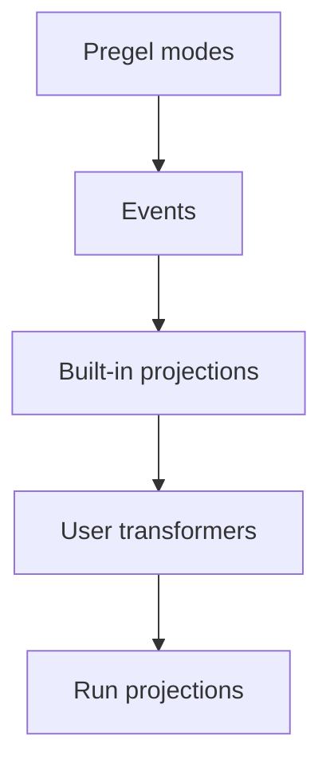

Event streaming is the recommended in-process streaming model for most LangGraph application code. It returns a run stream object that can be consumed in multiple ways at the same time.

## Quickstart

:::python
```py
stream = graph.stream_events({
    "messages": [{"role": "user", "content": "What is 42 * 17?"}],
}, version="v3")

for message in stream.messages:
    for token in message.text:
        print(token, end="", flush=True)

final_state = stream.output
```
:::

:::js
```ts
const stream = await graph.streamEvents(
  { messages: [{ role: "user", content: "What is 42 * 17?" }] },
  { version: "v3" }
);

for await (const message of stream.messages) {
  for await (const token of message.text) {
    process.stdout.write(token);
  }
}

const finalState = await stream.output;
```
:::

To stream against a graph deployed behind an Agent Server, see the [LangSmith Streaming API](/langsmith/streaming).

## How the pieces fit together

The streaming stack has two main layers:

1. **Streaming** emits raw graph execution events from the Pregel engine.
2. **Event streaming** normalizes those events, runs them through stream transformers, and exposes typed projections.

<div className="my-6 rounded-xl border bg-gray-50 p-4 dark:bg-gray-900">
  <div className="mx-auto max-w-2xl space-y-2 text-sm">
    <div className="rounded-lg border border-slate-300 bg-white p-3 text-center dark:border-slate-700 dark:bg-slate-950">
      <div className="font-semibold text-slate-900 dark:text-slate-100">Pregel engine</div>
      <div className="mt-1 text-xs text-slate-600 dark:text-slate-300">Runs graph steps</div>
    </div>
    <div className="text-center text-xs font-medium uppercase tracking-wide text-slate-500 dark:text-slate-400">emits</div>
    <div className="rounded-lg border border-orange-300 bg-orange-50 p-3 text-center dark:border-orange-800 dark:bg-orange-950">
      <div className="font-semibold text-orange-900 dark:text-orange-100">Raw Pregel events</div>
      <div className="mt-1 text-xs text-orange-700 dark:text-orange-300"><code>updates</code>, <code>values</code>, <code>messages</code>, <code>custom</code>, <code>checkpoints</code>, <code>tasks</code>, <code>debug</code></div>
    </div>
    <div className="text-center text-xs font-medium uppercase tracking-wide text-slate-500 dark:text-slate-400">sent to</div>
    <div className="rounded-lg border border-blue-300 bg-blue-50 p-3 text-center dark:border-blue-800 dark:bg-blue-950">
      <div className="font-semibold text-blue-900 dark:text-blue-100">Event router</div>
      <div className="mt-1 text-xs text-blue-700 dark:text-blue-300">Routes each event through the transformer pipeline</div>
    </div>
    <div className="text-center text-xs font-medium uppercase tracking-wide text-slate-500 dark:text-slate-400">cascades through</div>
    <div className="rounded-lg border border-green-300 bg-green-50 p-3 dark:border-green-800 dark:bg-green-950">
      <div className="font-semibold text-green-900 dark:text-green-100">Stream transformers</div>
      <div className="mt-2 grid gap-2 text-xs text-green-800 dark:text-green-200 sm:grid-cols-4">
        <div className="rounded border border-green-200 bg-white px-2 py-1 dark:border-green-800 dark:bg-green-950">ValuesTransformer</div>
        <div className="rounded border border-green-200 bg-white px-2 py-1 dark:border-green-800 dark:bg-green-950">MessagesTransformer</div>
        <div className="px-2 py-1 text-center text-green-600 dark:text-green-300">...</div>
        <div className="rounded border border-green-200 bg-white px-2 py-1 dark:border-green-800 dark:bg-green-950">Custom transformers</div>
      </div>
    </div>
    <div className="text-center text-xs font-medium uppercase tracking-wide text-slate-500 dark:text-slate-400">produces</div>
    <div className="rounded-lg border border-purple-300 bg-purple-50 p-3 text-center dark:border-purple-800 dark:bg-purple-950">
      <div className="font-semibold text-purple-900 dark:text-purple-100">Event Stream</div>
      <div className="mt-1 text-xs text-purple-700 dark:text-purple-300">Projected events for application code</div>
    </div>
  </div>
</div>

The event router is the bridge between the two layers. It receives normalized Pregel events and passes each event through the registered stream transformers. Built-in transformers create standard projections such as `stream.messages`, `stream.values`, `stream.subgraphs`, and `stream.output`. Custom transformers can add application-specific projections under `stream.extensions`.

## What event streaming provides

The run stream exposes typed projections over one underlying event flow:

| Projection | Use |
| ---------- | --- |
| `stream` | Iterate every protocol event. |
| `stream.messages` | Stream chat model messages and token deltas. |
| `stream.values` | Iterate state snapshots and await the final value. |
| `stream.output` | Await the final output. |
| `stream.subgraphs` | Discover and observe nested graph executions. |
| `stream.interrupts` | Inspect human-in-the-loop interrupt payloads. |
| `stream.interrupted` | Check whether the run paused for human input. |
| `stream.extensions` | Consume custom stream transformer projections. |

Multiple consumers can read these projections concurrently. Reading `stream.messages` does not consume events needed by `stream.values`, `stream.subgraphs`, or `stream.output`.

Event streaming sits one level above [streaming](/oss/langgraph/streaming), which exposes raw graph execution events through `stream_mode` modes such as `updates`, `values`, `messages`, `custom`, `checkpoints`, `tasks`, and `debug`. Use streaming when you need low-level access to those modes; use event streaming when application code benefits from typed projections.

## Stream messages

Use `stream.messages` for chat model output:

:::python
```py
stream = graph.stream_events(input, version="v3")

for message in stream.messages:
    text = str(message.text)
    usage = message.output.usage_metadata

    print(text)
    print(usage)
```
:::

:::js
```ts
const stream = await graph.streamEvents(input, { version: "v3" });

for await (const message of stream.messages) {
  const text = await message.text;
  const usage = await message.usage;

  console.log(text);
  console.log(usage);
}
```
:::

:::python
`message.text` is iterable in synchronous code. Iterate it for token-by-token output, or call `str(message.text)` for the complete text.

`message.reasoning` exposes reasoning deltas, and `message.tool_calls` exposes tool-call argument chunks. If you need text, reasoning, and tool-call chunks in exact arrival order, iterate the message stream's raw events instead of each projection separately.
:::

:::js
`message.text` is both an async iterable and a promise-like value. Iterate it for token-by-token output, or await it for the complete text.
:::

## Stream subgraphs

Use `stream.subgraphs` to observe nested graph work without parsing namespace strings:

:::python
```py
stream = graph.stream_events(input, version="v3")

for subgraph in stream.subgraphs:
    print(subgraph.graph_name, subgraph.path)

    for message in subgraph.messages:
        print(message.text)
```
:::

:::js
```ts
const stream = await graph.streamEvents(input, { version: "v3" });

for await (const subgraph of stream.subgraphs) {
  console.log(subgraph.name, subgraph.path);

  for await (const message of subgraph.messages) {
    console.log(await message.text);
  }
}
```
:::

For product-specific streams, see [Deep Agents streaming](/oss/deepagents/event-streaming) for subagent streams and [LangChain agent streaming](/oss/langchain/streaming) for tool calls and middleware events.

## Stream state

Use `stream.values` to stream full state snapshots after each step:

:::python
```py
stream = graph.stream_events(input, version="v3")

for snapshot in stream.values:
    print(snapshot)

final_state = stream.output
```
:::

:::js
```ts
const stream = await graph.streamEvents(input, { version: "v3" });

for await (const snapshot of stream.values) {
  console.log(snapshot);
}

const finalState = await stream.output;
```
:::

## Stream multiple projections

:::python
For concurrent consumption in async code, use `astream_events` with `asyncio.gather`:

```py
import asyncio

stream = await graph.astream_events(input, version="v3")

async def consume_messages():
    async for message in stream.messages:
        print(f"[llm] node={message.node}")

async def consume_subgraphs():
    async for subgraph in stream.subgraphs:
        print(f"[subgraph] path={subgraph.path}")

await asyncio.gather(consume_messages(), consume_subgraphs())
```

For synchronous code, use `stream.interleave(...)` to consume multiple projections in strict arrival order:

```py
stream = graph.stream_events(input, version="v3")

for name, item in stream.interleave("values", "messages", "subgraphs"):
    if name == "values":
        print(f"[state] keys={list(item)}")
    elif name == "messages":
        print(f"[llm] node={item.node}")
    elif name == "subgraphs":
        print(f"[subgraph] path={item.path}")
```
:::

:::js
Use concurrent consumers when you need multiple projections in JavaScript:

```ts
await Promise.all([
  (async () => {
    for await (const message of stream.messages) {
      console.log(await message.text);
    }
  })(),
  (async () => {
    for await (const subgraph of stream.subgraphs) {
      console.log(subgraph.path);
    }
  })(),
]);
```
:::

## Resume after an interrupt

When a graph pauses for human input, inspect `stream.interrupted` and `stream.interrupts`, then resume by calling `stream_events(..., version="v3")` again with `Command`.

Resume requires a graph compiled with a checkpointer and a config carrying a thread ID — see [persistence](/oss/langgraph/persistence).

:::python
```py
from langgraph.types import Command

stream = graph.stream_events(input, version="v3")

for message in stream.messages:
    print(message.text)

if stream.interrupted:
    print(stream.interrupts)

stream = graph.stream_events(
    Command(resume={"decisions": [{"type": "approve"}]}),
    version="v3",
)
final_state = stream.output
```
:::

:::js
```ts
import { Command } from "@langchain/langgraph";

let stream = await graph.streamEvents(input, { version: "v3" });

for await (const message of stream.messages) {
  console.log(await message.text);
}

if (stream.interrupted) {
  console.log(stream.interrupts);
}

stream = await graph.streamEvents(
  new Command({ resume: { decisions: [{ type: "approve" }] } }),
  { version: "v3" }
);
const finalState = await stream.output;
```
:::

## Stream all protocol events

Use the run object itself when you want the raw protocol event stream:

:::python
```py
stream = graph.stream_events({
    "messages": [{"role": "user", "content": "What is 42 * 17?"}],
}, version="v3")

for event in stream:
    namespace = event["params"]["namespace"]
    print(namespace, event["method"], event["params"]["data"])
```
:::

:::js
```ts
const stream = await graph.streamEvents(
  { messages: [{ role: "user", content: "What is 42 * 17?" }] },
  { version: "v3" }
);

for await (const event of stream) {
  const namespace = event.params.namespace;
  console.log(namespace, event.method, event.params.data);
}
```
:::

Each event is a `ProtocolEvent` envelope wrapping a channel-specific payload. The same shape is what a transformer's `process(event)` receives.

:::python
```py
class ProtocolEvent(TypedDict):
    seq: int                    # strictly increasing within a run; use for ordering
    method: str                 # channel name: "messages", "values", "updates", "custom", "tools", "lifecycle", ...
    params: ProtocolEventParams


class ProtocolEventParams(TypedDict):
    namespace: list[str]        # path of "<name>:<runtime_id>" segments from the root graph; [] is the root
    timestamp: int              # wall-clock milliseconds; can drift, don't rely on for ordering
    data: Any                   # channel-specific payload; shape depends on `method`
```
:::

:::js
```ts
interface ProtocolEvent {
  readonly seq: number;         // strictly increasing within a run; use for ordering
  readonly method: string;      // channel name: "messages", "values", "updates", "custom", "tools", "lifecycle", ...
  readonly params: {
    readonly namespace: string[];  // path of "<name>:<runtime_id>" segments from the root graph; [] is the root
    readonly timestamp: number;    // wall-clock milliseconds; can drift, don't rely on for ordering
    readonly node?: string;        // graph node that emitted this event, when applicable
    readonly data: unknown;        // channel-specific payload; shape depends on `method`
  };
}
```
:::

The `namespace` is a path from the root graph to the scope that emitted the event. The root is the empty array `[]`. Each child execution adds one `"name:runtime_id"` segment, so a nested tool call inside a subgraph looks like `["researcher:6f4d", "tools:91ac"]`. The name before `:` is the stable graph or node name; the suffix is a per-invocation runtime ID. Filter raw events by namespace yourself when you only care about a specific subtree — `stream.subgraphs` already does this for nested graph executions.

## Channels and event lifecycle

Raw events flow on channels. The channel name appears as the event's `method`; each channel emits a specific event shape.

| Channel | Purpose |
| ------- | ------- |
| `values` | Full graph state snapshots. |
| `updates` | Per-node state deltas. |
| `messages` | Content-block-centric chat model output. |
| `tools` | Tool call start, streamed output, finish, and error events. |
| `lifecycle` | Run, subgraph, and subagent status changes. |
| `checkpoints` | Lightweight checkpoint envelopes for branching and time travel. |
| `input` | Human-in-the-loop input requests and responses. |
| `tasks` | Pregel task creation and result events. |
| `custom` | User-defined payloads from graph code. |
| `custom:<name>` | Application-defined stream transformer output. |

The typed projections (`stream.messages`, `stream.values`, etc.) are built from these channels. The channel name appears as the `method` field on raw events when you iterate the run object directly.

### Messages

The `messages` channel models output as content blocks. The data's `event` field is one of:

- `message-start`
- `content-block-start`
- `content-block-delta`
- `content-block-finish`
- `message-finish`

Content blocks have explicit boundaries: a block starts, emits zero or more deltas, and finishes before the next block in the same message starts. This makes token streaming, reasoning blocks, tool-call blocks, and multimodal content explicit without requiring provider-specific formats. `message-finish` may include token usage; unrecoverable model-call failures arrive as message error events.

To consume raw content-block events directly instead of using the `stream.messages` projection:

:::python
```py
for event in stream:
    if event["method"] != "messages":
        continue

    data = event["params"]["data"][0]
    if not isinstance(data, dict):
        continue
    if data.get("event") != "content-block-delta":
        continue

    block = data.get("delta") or {}
    if block.get("type") == "text-delta":
        print(block.get("text", ""), end="", flush=True)
    elif block.get("type") == "reasoning-delta":
        print(f"[thinking]{block.get('reasoning', '')}", end="", flush=True)
```
:::

:::js
```ts
for await (const event of stream) {
  if (event.method !== "messages") continue;

  const data = event.params.data;
  if (data.event !== "content-block-delta") continue;

  const block = data.delta ?? {};
  if (block.type === "text-delta") {
    process.stdout.write(block.text ?? "");
  } else if (block.type === "reasoning-delta") {
    process.stdout.write(`[thinking]${block.reasoning ?? ""}`);
  }
}
```
:::

### Tools

The `tools` channel exposes tool execution. The data's `event` field is one of:

- `tool-started`
- `tool-output-delta`
- `tool-finished`
- `tool-error`

Tool events are correlated by tool call ID, so a tool execution can be joined back to its originating tool-call content block on the `messages` channel.

### Lifecycle

The `lifecycle` channel tracks root run, subgraph, and subagent status. The data's `event` field is one of:

- `started`
- `running`
- `completed`
- `failed`
- `interrupted`

Beyond `event`, lifecycle data may include an optional `graph_name`, `error`, and `cause` describing why a child scope started (parent tool call, fan-out send, edge transition).

## Build your own projection

Stream transformers are the projection layer in event streaming. They observe protocol events, keep their own state, and expose derived views of a run — things like tool activity, token totals, progress events, artifacts, or messages for another protocol. `StreamChannel` is the projection primitive transformers use to publish those views.

Built-in projections (`stream.messages`, `stream.values`, `stream.subgraphs`, `stream.output`) and product-specific projections (LangChain's `stream.tool_calls`, Deep Agents' `stream.subagents`) are themselves transformers using this same contract. User transformers stack on top via compile-time or call-time registration, and their projections appear under `stream.extensions`.

Write one when the existing projections don't match the shape an application needs.

### How transformers work

Event streaming starts with streaming output from the LangGraph Pregel engine. The runtime normalizes those chunks into protocol events, then a stream handler routes each event through a stack of stream transformers.



The stream handler is the central dispatcher for one stream. For every protocol event, it:

1. Calls each registered transformer's `process(event)` hook in order.
2. Wires named `StreamChannel` pushes back onto the protocol event stream.
3. Stores the event in the run stream unless a transformer suppresses it.
4. Calls `finalize()` or `fail()` on every transformer when the run ends.

Transformers are observational. They do not call back into the graph runtime. Instead, they consume events and push derived values into `StreamChannel`, promises, or other projection objects.

### Transformer shape

A transformer implements the `StreamTransformer` interface:

:::python
```py
from langgraph.stream import ProtocolEvent, StreamTransformer


class MyTransformer(StreamTransformer):
    def init(self) -> dict:
        ...

    def process(self, event: ProtocolEvent) -> bool:
        ...

    def finalize(self) -> None:
        ...

    def fail(self, err: BaseException) -> None:
        ...
```
:::

:::js
```ts
interface StreamTransformer<TProjection = unknown> {
  init(): TProjection;
  process(event: ProtocolEvent): boolean;
  finalize?(): void | PromiseLike<void>;
  fail?(err: unknown): void;
}
```
:::

- `init()` creates the projection object. User transformer projections appear under `stream.extensions`.
- `process()` observes each protocol event. See [Stream all protocol events](#stream-all-protocol-events) for the `ProtocolEvent` shape. Return `false` only when you intentionally want to suppress the original event.
- `finalize()` closes or resolves non-channel projections after a successful stream.
- `fail()` propagates errors to non-channel projections.

### Declaring required stream modes

`required_stream_modes` controls which Pregel stream modes the underlying graph emits during the stream. The runtime takes the union of every registered transformer's `required_stream_modes` and passes that union as the `stream_mode` argument to the graph's `.stream()` call. **Modes that no transformer requests are never emitted** — declaring `("custom",)` is what causes `custom` events to flow through the run at all.

:::python
```py
class CustomTransformer(StreamTransformer):
    required_stream_modes = ("custom",)  # [!code highlight]

    def process(self, event: ProtocolEvent) -> bool:
        if event["method"] == "custom":
            ...
        return True
```
:::

`process()` receives every event the graph emits and is responsible for filtering by `event["method"]`. The declaration turns on upstream emission; it does not narrow what `process()` sees. Valid values are the Pregel stream modes: `"messages"`, `"tools"`, `"custom"`, `"values"`, `"updates"`, `"checkpoints"`, `"tasks"`, `"debug"`. Each transformer must declare every mode it acts on — an omitted mode is not emitted by the graph and never reaches `process()`.

### StreamChannel

`StreamChannel` is the projection primitive a transformer uses for streaming values. It always exposes an iterable stream on `stream.extensions.<name>`. The constructor argument decides whether each `push()` also flows into the run's main event stream as a `custom:<name>` event—that is, whether the projection's values show up when iterating raw protocol events.

:::js
| Need | Use |
| ---- | --- |
| Side-channel projection only | `new StreamChannel<T>()` |
| Also flow each push into the main event stream | `new StreamChannel<T>(name)` |
:::

:::python
| Need | Use |
| ---- | --- |
| Side-channel projection only | `StreamChannel()` |
| Also flow each push into the main event stream | `StreamChannel(name)` |
:::

Named channel payloads must be serializable, because each pushed value also becomes a `custom:<name>` protocol event in the main stream. Keep promises, async iterables, class instances, and other in-process handles in unnamed channels.

The stream handler owns channel lifecycle. Once `init()` returns a channel, the handler closes or fails it for you when the run ends. Transformers only push values.

### Example: named channel

Pass a string name to `StreamChannel` to expose a streaming projection through `stream.extensions` *and* forward each pushed value into the run's main event stream as a `custom:<name>` protocol event:

:::python
```py
from typing import TypedDict

from langgraph.stream import ProtocolEvent, StreamChannel, StreamTransformer


class ToolActivity(TypedDict):
    name: str
    status: str


class ToolActivityTransformer(StreamTransformer):
    required_stream_modes = ("tools",)

    def __init__(self, scope: tuple[str, ...] = ()) -> None:
        super().__init__(scope)
        self.activity = StreamChannel[ToolActivity]("tool_activity")

    def init(self) -> dict:
        return {"tool_activity": self.activity}

    def process(self, event: ProtocolEvent) -> bool:
        if event["method"] != "tools":
            return True

        data = event["params"]["data"]
        if isinstance(data, dict) and data.get("tool_name") and data.get("event"):
            status = "error" if data["event"] == "tool-error" else "started"
            self.activity.push({"name": data["tool_name"], "status": status})
        return True
```
:::

:::js
```ts
import { StreamChannel } from "@langchain/langgraph";

const toolActivityTransformer = () => {
  const activity = new StreamChannel<{
    name: string;
    status: "started" | "finished" | "error";
  }>("toolActivity");

  return {
    init: () => ({ toolActivity: activity }),
    process(event) {
      if (event.method === "tools") {
        const data = event.params.data as { tool_name?: string; event?: string };
        if (data.tool_name && data.event) {
          activity.push({
            name: data.tool_name,
            status: data.event === "tool-error" ? "error" : "started",
          });
        }
      }
      return true;
    },
  };
};
```
:::

### Example: unnamed channel

Without a name, the channel is a side-channel projection only — accessible on `stream.extensions` but not visible to consumers iterating raw events. This is the right choice for projections that hold in-process handles (promises, async iterables, class instances) that can't be serialized onto the main event stream.

The example below pairs an unnamed channel with `get_stream_writer`, which lets graph nodes emit `custom`-channel events that the transformer then drains into the projection:

:::python
```py
from langgraph.config import get_stream_writer
from langgraph.stream import ProtocolEvent, StreamChannel, StreamTransformer


def node(state):
    writer = get_stream_writer()
    writer({"kind": "progress", "message": "retrieving context"})
    return state


class CustomTransformer(StreamTransformer):
    required_stream_modes = ("custom",)

    def __init__(self, scope: tuple[str, ...] = ()) -> None:
        super().__init__(scope)
        self.log = StreamChannel()

    def init(self) -> dict:
        return {"custom": self.log}

    def process(self, event: ProtocolEvent) -> bool:
        if event["method"] == "custom":
            self.log.push(event["params"]["data"])
        return True


stream = graph.stream_events(input, version="v3", transformers=[CustomTransformer])

for item in stream.extensions["custom"]:
    print(item)
```
:::

:::js
```ts
import { StreamChannel } from "@langchain/langgraph";

const customTransformer = () => {
  const custom = new StreamChannel<unknown>();

  return {
    init: () => ({ custom }),
    process(event) {
      if (event.method === "custom") {
        custom.push(event.params.data);
      }
      return true;
    },
  };
};
```
:::

### Example: final-value projection

Use unnamed streams, promises, or other in-process objects when the projection should not flow into the main event stream:

:::python
```py
from langgraph.stream import ProtocolEvent, StreamChannel, StreamTransformer


class StatsTransformer(StreamTransformer):
    required_stream_modes = ("messages",)

    def __init__(self, scope: tuple[str, ...] = ()) -> None:
        super().__init__(scope)
        self.total_tokens = 0
        self.total_tokens_log = StreamChannel[int]()

    def init(self) -> dict:
        return {"total_tokens": self.total_tokens_log}

    def process(self, event: ProtocolEvent) -> bool:
        data = event["params"]["data"]
        if isinstance(data, dict):
            usage = data.get("usage") or {}
            self.total_tokens += usage.get("output_tokens") or 0
        return True

    def finalize(self) -> None:
        self.total_tokens_log.push(self.total_tokens)
        self.total_tokens_log.close()
```
:::

:::js
```ts
const statsTransformer = () => {
  let totalTokens = 0;
  let resolveTotal!: (value: number) => void;
  const totalTokensPromise = new Promise<number>((resolve) => {
    resolveTotal = resolve;
  });

  return {
    init: () => ({ totalTokens: totalTokensPromise }),
    process(event) {
      if (event.method === "messages") {
        const data = event.params.data as { usage?: { output_tokens?: number } };
        totalTokens += data.usage?.output_tokens ?? 0;
      }
      return true;
    },
    finalize: () => resolveTotal(totalTokens),
  };
};
```
:::

### Register at call time or compile time

Pass transformers at call time for local experimentation:

:::python
```py
stream = graph.stream_events(
    input,
    version="v3",
    transformers=[StatsTransformer, ToolActivityTransformer],
)
```
:::

:::js
```ts
const stream = await graph.streamEvents(input, {
  version: "v3",
  transformers: [statsTransformer, toolActivityTransformer],
});
```
:::

Compile transformers into the graph when every run of that graph should produce the projection:

:::python
```py
graph = builder.compile(
    transformers=[StatsTransformer, ToolActivityTransformer],
)
```
:::

:::js
```ts
const graph = builder.compile({
  transformers: [statsTransformer, toolActivityTransformer],
});
```
:::

### Built-in: `ToolCallTransformer`

:::python
LangGraph ships `ToolCallTransformer` as a built-in. Register it to expose `stream.tool_calls` on a plain `StateGraph`:

```py
from langgraph.prebuilt import ToolCallTransformer

stream = graph.stream_events(input, version="v3", transformers=[ToolCallTransformer])

for tool_call in stream.tool_calls:
    print(tool_call.tool_name, tool_call.input)
```
:::

## Related

LangGraph defines the streaming primitives. For using streaming with LangChain or Deep Agents, review the relevant product docs:

- [LangChain agent streaming](/oss/langchain/event-streaming) covers ReAct-style agent messages, tool calls, and middleware updates.
- [Deep Agents streaming](/oss/deepagents/event-streaming) covers subagents, nested messages, and subagent tool calls.
- [LangChain frontend patterns](/oss/langchain/frontend/overview) and [LangGraph frontend patterns](/oss/langgraph/frontend/overview) show UI use cases built on top of streamed state.
- [LangSmith Streaming API](/langsmith/streaming) covers streaming against a graph deployed behind an Agent Server.

The wire-level event and command formats are defined in the [Agent Protocol](https://github.com/langchain-ai/agent-protocol) repository and consumable as [`langchain-protocol`](https://pypi.org/project/langchain-protocol/) on PyPI and [`@langchain/protocol`](https://www.npmjs.com/package/@langchain/protocol) on npm.
